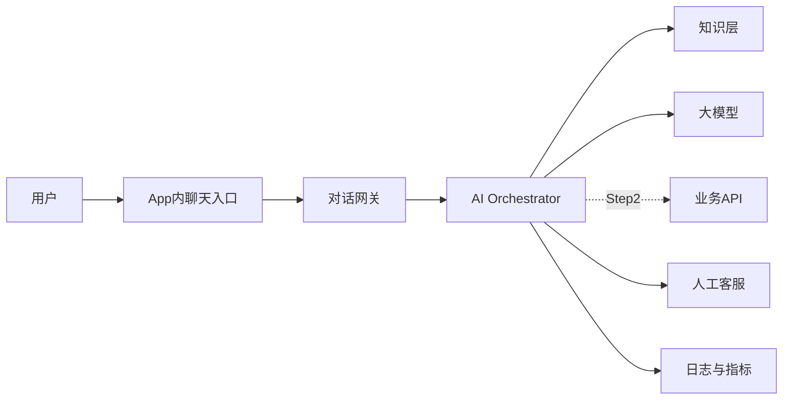

# AIX AI 客服一期方案（v2）

## 第一部分：项目定义

### 1.1 项目定位（产出）

本项目的交付对象有两层：

1. **产品交付**：在 AIX App 内落地一期 AI 客服能力，完成 Step 1 的问答与指引闭环，并为 Step 2 预留接口。
2. **机制交付**：形成一套可复用的 AI 时代产研协作方式，包括需求进入、快速实现、验证、灰度、复盘、知识更新与问题闭环。

本期默认以**产品落地优先**，团队机制服务于产品交付，不单独追求形式上的“AI 化”。

### 1.2 实验目标（目标）

10 周内需要同时回答四个问题：

| 维度 | 本期目标 | 产出形式 |
|---|---|---|
| 用户使用 | AI 客服在真实场景中被用户使用，并形成稳定会话量 | 体验层指标 + 典型会话样本 |
| 产品质量 | Step 1 在三类问题上可用、稳定、不乱答 | 评测结果 + 风险事件记录 |
| 团队提速 | 相比传统流程，需求闭环更短、发布频率更高 | 周度迭代数据 + 需求闭环时长 |
| 机制沉淀 | 可复用到其他业务的协作方式被沉淀出来 | SOP、模板、门禁表、工作日记 |

本期不以“大而全功能”作为成功标准，而以**可上线、可观测、可复用**作为成功标准。

### 1.3 团队角色与权限（决策）

| 角色 | 责任 | 权限边界 |
|---|---|---|
| 产品方向（Bowen / Yifeng） | 产品定位、场景取舍、口径与阶段目标 | 可拍板产品范围、小中型改动、阶段目标调整 |
| 工程实现（Robbie + AI x） | 入口、网关、编排、API、发布 | 可拍板技术实现方案、发布节奏、回滚执行 |
| 架构与资源（Magic） | 资源协调、关键风险、跨团队问题 | 可拍板资源配置、关键阶段取舍 |
| 数据 / AI（Fox / Hanjie） | Prompt、评测、指标、数据归因 | 可拍板评测方案、指标统计口径 |
| 合规 / 客服（按场景参与） | 红线、服务处理、人工承接 | 对红线、人工兜底、对客风险有否决权 |

**上线权限**：团队内部可自主推进，不依赖外部常规评审流程；但涉及红线、对客放量、接口扩权、资金与身份相关动作时，必须按本方案中的大决策链路执行。 

---

## 第二部分：一期产品方案（主线）

### 2.1 产品定位（目标）

AIX App 内置的 AI 客服入口，面向 AIX 用户，承担**解释与引导**职责，不承担业务处置。一期能做与不做的边界见 2.3。

### 2.2 用户问题类型与场景（产出）

一期聚焦三类高频问题：

| 问题类型 | 用户提问形态示例 | 期望的答复形态 |
|---|---|---|
| 产品规则问答 | "开卡费多少？" "支持哪些国家？" "为什么我没这个按钮？" | 直接给出规则 + 引用来源 |
| 状态解释 | "这个状态是什么意思？" "为什么我被限制了？" "为什么审核没过？" | 解释状态含义 + 给下一步建议 |
| 操作路径引导 | "开卡怎么开？" "这一步该点哪里？" "在哪里改密码？" | 分步骤指引 + 指向对应页面 |

三类问题之外（投诉、纠纷、资金争议、情绪宣泄等），**一期明确不接管，直接转人工**。

### 2.3 功能范围与边界（决策）

| 范围 | 是否纳入一期 | 备注 |
|---|---|---|
| 自然语言问答（三类问题） | 是 | 核心能力 |
| 引用溯源（显示答案来自哪条知识） | 是 | 提升可信度与可追责 |
| 转人工 | 是 | 无法回答、越界、用户要求均转 |
| 多轮追问 | 是（有限轮次） | 一期不做长程记忆，仅保留当前会话上下文 |
| 业务 API 实时数据查询 | 否 | 归入五阶段路径 Step 2 |
| 代用户执行操作 | 否 | 归入五阶段路径 Step 3 |
| 拟人化、性格化交互 | 否 | 归入五阶段路径 Step 4 |
| 模型自训练与人工标注体系 | 否 | 归入五阶段路径 Step 5 |
| 账户 / 资料 / 状态修改 | 否 | 始终由用户或人工执行 |
| 资金相关动作（发起 / 确认 / 撤销） | 否 | 始终由现有通路执行 |
| 复杂业务投诉与纠纷处理 | 否 | 直接转人工 |
| 人工最终裁决 | 否 | 由人工客服负责 |

### 2.4 五阶段落地路径（产出）

| 阶段 | 核心能力 | 典型问题 | 进入条件 |
|---|---|---|---|
| Step 1 · 自有数据问答 | 基于 FAQ、产品文档、过往案例、规则库回答用户问题，给出操作指引 | "开卡费多少？" "这个状态什么意思？" | 项目启动即开始 |
| Step 2 · 信息查询 | 通过 API 实时提取用户自身信息，给出个性化答复 | "我当前的额度是多少？" "我上一笔交易状态是什么？" | Step 1 上线稳定、API 对接方案确认 |
| Step 3 · 行为触发 | 根据用户指令执行特定动作（在用户确认前提下） | "帮我重置密码" "帮我提交一次申诉" | Step 2 稳定、授权与二次确认机制就位 |
| Step 4 · 拟人化交互 | 更自然的对话体验、更贴合 AIX 产品风格的语气与话术 | 体验层优化 | Step 3 稳定、有足够线上对话样本 |
| Step 5 · 自训练与标注 | 建立持续学习闭环，模型与策略由真实数据驱动迭代 | 模型 / 策略自进化 | Step 3–4 数据量和质量达阈值 |

一期**只做 Step 1，预留 Step 2 接口**；Step 3–5 本方案只定方向。

### 2.5 知识体系框架（产出）

一期知识来源分四类，每类有明确定义、典型问题和 Owner：

| 类型 | 承载内容 | 适合回答 | Owner |
|---|---|---|---|
| FAQ 文档 | 高频问题的标准短答 | "开卡费多少？" "支持哪些国家？" | 产品 + 客服共建 |
| 产品知识文档 | 页面规则、功能规则、状态定义、操作路径 | "这个状态什么意思？" "下一步点哪里？" | 产品 |
| 业务规则文档 | 国家线、场景限制、例外规则 | "为什么我不行？" "为什么被拦截？" | 业务 / 合规 |
| 服务处理文档 | 系统内走不通的处理流程、补件要求 | "系统走不下去了怎么办？" "联系谁？" | 客服 |

知识条目最低字段、生命周期与上线门禁见 3.6。

### 2.6 系统架构与流程（产出）

单次请求标准链路：

1. 用户在 App 聊天入口发送问题
2. 网关做基础校验、身份标识、请求限流
3. AI Orchestrator 识别问题类型、调取相应知识片段、组装 prompt、调用 LLM
4. 输出经过安全校验（红线、越界、引用完整性）
5. 答复返回给用户，同时写入日志与指标管道
6. 用户侧可追问、可转人工、可反馈

### 2.7 用户入口与交互（产出）

**入口位置**
- 主入口：AIX App 内独立的"客服 / 帮助"聊天页
- 辅入口（可选）：关键业务页面（开卡、审核、交易详情）上的"问一下 AI"轻提示

**交互形态**
- 文字输入为主
- 支持常见问题快捷卡片（进入聊天即展示 3–5 个热门问题）
- 答复中可内嵌引用来源标签（点击可查看原文）
- 会话底部常驻"转人工"按钮

**会话规则**
- 单会话生命周期：从打开到关闭，最长保留 N 轮上下文（具体数值待测试）
- 同一用户跨会话不做长程记忆
- 每条答复可单独点赞 / 点踩 / 反馈

### 2.8 异常处理与兜底（决策）

| 异常情形 | 处理方式 |
|---|---|
| 知识库中无匹配信息 | 给出"当前无法回答"话术 + 建议转人工，不允许猜测作答 |
| 命中低置信规则（引用缺失 / 检索弱命中 / 多次生成不稳定） | 附带提示"以下信息供参考，建议与人工客服确认"，必要时直接转人工 |
| 涉及资金、身份变更、合规口径 | 直接走预设话术 + 强制转人工，不调用 LLM 生成 |
| 用户明确要求人工 | 立即转人工，不挽留 |
| 用户提出系统无法处理的问题（投诉、纠纷、情绪） | 转人工 |
| LLM 超时 / 报错 / 返回异常格式 | 降级为 FAQ 检索；仍失败则转人工 |
| 出现安全红线触发（越界话题、敏感内容） | 终止本轮生成，走预设话术，记录事件 |

**兜底原则**：宁可少答、宁可直接转人工，不允许乱答；所有兜底路径必须可被触发、可被观测、可被回放。

### 2.9 指标设计（指标）

**体验层（用户角度）**
- 进入率：进入聊天页的用户占 App 活跃用户的比例
- 自助完成率：一次会话中用户获得答复、未转人工、且未在同一问题上重复追问超过 1 次的比例
- 用户正反馈率：点赞 / 总评价
- 转人工率：触发转人工的会话占比（过高过低都需观察）

**质量层（回答本身）**
- 有效答复率：抽样会话中被人工判定为“解决了用户问题”的比例
- 正确率：抽审样本中答复正确的比例
- 越界率：抽审样本中答复超出边界或触碰红线的比例
- 引用覆盖率：答复带有有效引用的比例
- 无法回答率：系统主动说"无法回答"的比例

**风险层（安全与稳定）**
- 红线触发次数
- 异常兜底触发次数
- LLM 调用失败率与平均延迟
- 投诉与反馈中涉及 AI 答复的条数

阈值与看板样式统一在 4.2 阶段门禁口径落地，指标采集由 2.6 的日志与指标管道承接。

---

## 第三部分：AI-native 团队机制（副线）

### 3.1 团队组织架构（决策）

| 角色 | 人员 | 职责 |
|---|---|---|
| 产品方向（主导） | Bowen Li (Eli) / Yifeng Wu | 产品定位、场景取舍、对客口径拍板 |
| 工程实现 | Robbie Yan + AI x 派驻全栈工程师 | 聊天入口、API 对接、AI Orchestrator、发布 |
| 架构与资源 | Magic Tang | 资源协调、架构把关、关键决策参与 |
| 数据 / AI | Fox Hu / Hanjie Zhang | Prompt、评测、日志聚类、指标 |
| AI（团队成员） | Cursor / 所在工作流内的模型 | 承担重复性劳动与初稿产出 |

**团队权限**：内部可自行拍板上线，对结果负责，无外部评审依赖。
**组织原则**：AI 不是工具，而是团队成员；每个人都要建立自己的 AI 工作流。

### 3.2 AI 时代的产研流程（产出）

与传统流程的差异：

| 环节 | 传统流程 | 本项目流程 |
|---|---|---|
| 需求进入 | 业务方提需求 → 产品评审 | 问题直接进群 / 问题池，当天对齐 |
| 需求定义 | 完整 PRD | 轻量问题定义（见下）|
| 设计 | UI 设计师出稿 → 评审 | 产品 + AI 共同先出草图 / 描述，再优化 |
| 开发 | 排期 → Sprint → 交付 | 当天开发，AI 初稿 + 人修正，不等 Sprint |
| 测试 | QA 全量验收 | AI 接口自测 + 抽样回归 + 线上灰度 |
| 上线 | 版本发布 | 小步灰度，可快速回滚 |
| 迭代 | 下个版本规划 | 当日问题当日改，周会校准方向 |

**一条需求的最小定义（四条必须回答）**：
- 要解决什么问题
- 影响哪个场景
- 期望的答复 / 行为是什么
- 风险点与红线

**实现对象不止代码**：Prompt、知识、路由策略、API 对接、前后端能力，均属于实现范畴。

**快车道（当天改、当天看）**：
- FAQ 补充
- 知识纠错
- Prompt 微调
- 话术优化

**慢车道（需要评审或灰度）**：
- 新增业务接口接入
- 涉及资金 / 身份 / 合规口径变更
- 影响大盘流量的核心策略改动
- 红线范围调整

### 3.3 协作流程与沟通机制（产出）

- **群内即时沟通**：主频道随时提问题、对齐、推进；尽量不开不必要的会。
- **每日轻量同步（15 分钟内）**：
  - 今天 AI 替代了哪些工作
  - 今天遇到的问题
  - 今天需要协助的事
- **每周固定会议**：进度对齐、方向校准、指标复盘。
- **记录从第一天开始**：工作日记、AI 交互、决策均实时留痕，细节见 3.6。

### 3.4 决策与拍板机制（决策）

| 决策颗粒 | 示例 | 拍板方式 |
|---|---|---|
| 小 | Prompt / 话术 / FAQ / 异常话术 | 产品方向一人决定，事后群内公告 |
| 中 | 新场景、新路由、新知识域 | 产品 + 工程 2 人确认，群内留痕 |
| 大 | 接入新接口、红线永久调整、模型更换、对客放量 | Bowen + Yifeng + Magic 三方确认；涉及红线与对客风险时需合规共同确认 |

AI 输出与现有规则冲突时的处理方式见 3.6 规则防漂移。

### 3.5 AI 与人角色分工（产出）

| 工作类型 | AI 优先承担 | 人优先承担 |
|---|---|---|
| 产品设计 | 初稿输出、用例生成、对照分析 | 方向判断、场景取舍、最终拍板 |
| 写代码 | 模板代码、常规实现、单元测试 | 架构决策、技术选型、关键接口 |
| 文案 | FAQ 撰写、话术首稿、状态解释 | 对外口径审核、合规敏感部分 |
| 测试 | 接口自测、功能走查、数据生成 | 设备端回归、兼容性、体验主观判断 |
| 数据 | 日志聚类、问题归因首稿 | 指标定义、阈值判断、结论解读 |
| 文档 | 会议纪要首稿、产物汇总 | 结构定稿、核心结论、对外表达 |

**信任边界（一期默认）**：AI 输出多为建议稿，由人执行修改与提交。  
后续根据线上数据表现，逐步放开"AI 直接修改 / 直接部署"的范围。

### 3.6 知识更新与沉淀（产出）

- **知识条目生命周期**：采集 → 转译 → 审核 → 上线 → 过期 → 重训。
- **最低字段**：问题 / 答复 / 引用来源 / 生效范围 / 更新时间 / Owner。
- **上线门禁**：
  - 高风险知识（合规、身份、限制原因、服务处理）每条上线前必须有至少 1 条对应评测用例通过；
  - 一般知识按“知识簇 / 场景批次”覆盖评测，不要求每条都单独配 1 条用例。
- **变更留痕**：每条知识的修改历史、修改人、修改原因可追溯。
- **规则防漂移**：
  - 团队共享一份"规则备忘"，关键规则（口径、红线、边界）写入其中；
  - AI 输出与共享规则冲突时，以 Owner 为准；Owner 不在场则延后决策，AI 不擅自修改共享规则；
  - 每发生一次违规建议，由 Owner 记录一次并在 Prompt 中重新强调。
- **工作日记**：每人每日记录 AI 替代的工作、遇到的问题、规则调整，作为 SOP 素材。

### 3.7 问题闭环机制（产出）

- **入口**：用户点踩 / 主动反馈 / 日志异常 / 线上投诉 / 内部自查。
- **分类**：知识问题 / Prompt 问题 / 策略问题 / 工程问题 / 红线触发。
- **处理节奏**：
  - 知识 & Prompt 问题：当日处理
  - 策略 & 工程问题：周内处理
  - 红线触发：立即降级 + 同日内复盘
- **关闭条件**：对应评测样本通过 + 线上相同模式未复现 + Owner 确认。
- **可观测**：每个问题有唯一 ID，关联到对应的知识变更、Prompt 变更、代码变更、发布记录。

---

## 第四部分：10 周推进框架

### 4.1 阶段划分（产出）

10 周拆成 4 个阶段，进入下一阶段以**退出条件达成**为准，不以周次为准：

| 阶段 | 周次 | 主题 | 结束时的状态 |
|---|---|---|---|
| 阶段 0 · 启动与基建 | W1 | 团队就位、最小基础设施搭建 | 可跑通一次端到端的问答闭环 |
| 阶段 1 · 内测可用 | W2–W4 | Step 1 能力在内测环境上线 | 团队内部 + 客服可自测使用 |
| 阶段 2 · 员工灰度 | W5–W7 | 面向 AIX 内部员工放开 | 真实使用数据回流、知识库扩充 |
| 阶段 3 · 对客灰度 + 实验收口 | W8–W10 | 白名单外部用户 + 实验评估 | 得出"是否全量 / 是否复用"的判断 |

### 4.2 阶段门禁口径（决策）

为避免“指标有名字、上线没门槛”，本期在 W1 末冻结一版《阶段门禁表》，由**产品方向 + 数据 / AI + 工程**共同拍板。  
后续 W4、W7 只允许微调，不允许临近上线临时降标准。

| 门禁维度 | W4 内测门禁 | W7 员工灰度门禁 | W8+ 对客灰度门禁 | Owner |
|---|---|---|---|---|
| 正确率 | 抽审正确率 >= 80% | 抽审正确率 >= 85% | 抽审正确率 >= 90% | 数据 + 产品 |
| 有效答复率 | 抽样有效答复率 >= 70% | 抽样有效答复率 >= 75% | 抽样有效答复率 >= 80% | 数据 + 产品 |
| 越界率 | 评测集越界率 = 0 | 评测集越界率 = 0 | 评测集越界率 = 0 | 产品 + 合规 |
| 引用覆盖率 | >= 80% | >= 85% | >= 90% | 产品 |
| 兜底可用性 | 所有异常路径可触发 | 人工兜底链路可闭环 | 人工兜底 SLA 稳定 | 工程 + 客服 |
| 稳定性 | 基本链路可复现 | 故障率低于预设阈值 | 连续 2 周稳定运行 | 工程 |

说明：
- **正确率 / 有效答复率** 以人工抽审为准，不以模型自评分为准。
- **低置信规则** 不单独作为放量门禁，而作为兜底触发条件。
- 任何阶段如触发红线事件，自动回退到上一个稳定阶段。

### 4.3 每阶段目标与交付物（产出）

#### 阶段 0 · 启动与基建（W1）
- **目标**：最小可用闭环能跑通一次。
- **交付物**：
  - 团队成员与权限就位（含 AI x 派驻工程师）
  - 知识库 v0（FAQ 50+ 条、覆盖三类问题）
  - Prompt 基线版本
  - 评测集 v0（20–30 条典型问题 + 红线问题，覆盖三类问题主路径与高风险知识）
  - 聊天入口原型（本地 / Dev 环境）
  - 日志、指标管道打通
- **退出条件**：一次端到端问答全流程可复现，且 W1 版《阶段门禁表》冻结。

#### 阶段 1 · 内测可用（W2–W4）
- **目标**：Step 1 在内测环境上线，团队可日常自测。
- **交付物**：
  - 聊天入口接入 App 内测版
  - 知识库 v1（覆盖一期承接的全部三类问题主路径）
  - 异常兜底路径全部可触发
  - 工作日记 + 问题池机制跑通
  - 首次评测通过（达到 4.2 中 W4 门禁）
- **退出条件**：团队内部 + 客服连续 3 天日常使用无 P0 级异常，且达到 4.2 中 W4 门禁。

#### 阶段 2 · 员工灰度（W5–W7）
- **目标**：面向 AIX 内部员工放开，数据回流跑通。
- **交付物**：
  - 灰度开关就位
  - 指标看板（体验 / 质量 / 风险三层）
  - 人工兜底路径与客服对接完成
  - 知识库 v2（根据灰度反馈补充、纠错）
  - 首份数据归因报告
- **退出条件**：达到 4.2 中 W7 门禁，红线事件为 0，问题闭环节奏稳定。

#### 阶段 3 · 对客灰度 + 实验收口（W8–W10）
- **目标**：对白名单外部用户放开，同时完成实验评估与 SOP 沉淀。
- **交付物**：
  - 白名单灰度上线
  - 线上指标连续 2 周稳定记录
  - 实验评估报告（覆盖 4 维：用户使用、团队提速、AI 占比、SOP）
  - 可复制的协作 SOP 文档
  - 下一阶段建议（是否全量 / 是否扩展 Step 2）
- **退出条件**：达到 4.2 中对客门禁，实验结论清晰，足以支撑决策层判断是否继续推进。

### 4.4 关键里程碑（产出）

| 里程碑 | 时间点 | 判定依据 |
|---|---|---|
| M1 · 基建就位 | W1 末 | 端到端问答闭环可复现 |
| M2 · 内测上线 | W4 末 | 首次评测通过，团队可日常使用 |
| M3 · 员工灰度开启 | W5 | 灰度开关就位、指标看板可读 |
| M4 · 对客灰度开启 | W8 | 关键指标连续达标、红线清零 |
| M5 · 实验收口 | W10 末 | 实验评估报告 + SOP 交付 |

里程碑**按"状态达成"判定，不按周次强行推进**；如某一里程碑延期，后续阶段顺延，但 M5 原则上不延。

### 4.5 风险与应对策略（决策）

| 风险类型 | 触发信号 | 阈值 / 判定 | 应对动作 | 责任人 |
|---|---|---|---|---|
| 回答错误 | 抽审正确率下降、用户点踩增加 | 正确率低于预设下限 | 暂停新知识上线，定位问题源，必要时回滚 Prompt / 知识 | 产品方向 + 数据 |
| 红线越界 | 触发敏感话题 / 合规禁区 | 单次即触发 | 立即降级为预设话术、暂停放量；当日复盘；永久性红线清单调整按 3.4 大决策链路执行 | 产品方向 + 合规 |
| 测试覆盖不足 | 线上出现未覆盖场景的失败 | 同类问题出现 3 次以上 | 补充评测集，回归后再恢复放量 | 数据 + AI x |
| 快改引入回归 | 小改导致已有能力变差 | 评测集回归失败 | 走慢车道、走灰度流程，不再直改 | 工程 |
| 规则漂移 | AI 在多轮对话后偏离共享规则 | 出现 2 次以上同类违反 | 规则写入共享备忘，重构 Prompt 层级 | 数据 / AI |
| 资源不到位 | AI x 工程师未按时到岗、关键角色空缺 | 某角色缺位超 3 天 | 上报 Magic Tang，协调资源或缩小阶段目标 | Magic Tang |
| 用户反馈异常 | 投诉 / 舆情涉及 AI 答复 | 单日反馈超阈值 | 灰度收缩或暂停、同步客服话术 | 产品方向 + 客服 |
| 实验结论不清 | 关键指标无法有效读数 | 数据质量不足 | 延长观察窗口、补充埋点、调整评估方式 | 数据 |

**兜底原则**：任何风险触发都优先保用户体验与合规安全；宁可阶段目标延期，不压缩风险处理周期。

---

## 待讨论项

### 1. 人工兜底方式（待决）

当前需要确认三件事：

1. **入口形态**：直接跳人工客服，还是先进入客服工作台待接入。
2. **承接 SLA**：员工灰度阶段与对客灰度阶段，人工承接时限分别是多少。
3. **责任归属**：人工接入后的问题是否继续回流到问题池，以及由谁负责闭环。

建议：
- W5 前先按“跳转人工客服 + 群内跟单”的简化方式落地；
- W8 前再补正式客服工作台衔接。

### 2. 工程资源配置（待决）

当前需要确认三件事：

1. **AI x 派驻工程师到岗时间**：是否能在 W1 内到位。
2. **前端 / 后端 / 编排能力是否由同一人承担**，还是拆成两段协作。
3. **日志、指标、灰度开关**由业务工程补，还是 AI x 工程统一补。

建议：
- W1 若 AI x 资源未到位，则缩小阶段 0 范围，只保留聊天入口原型 + 知识问答链路；
- API 对接、灰度系统、对客阶段能力整体后移，不硬顶进度。

---

## 关键交付物清单

每项交付物明确：**内容 / Owner / 交付节点 / 更新机制**。

### 交付物 1 · 项目方案文档
- **内容**：本文件。覆盖项目定义、一期产品方案、团队机制、10 周推进框架、待讨论项。
- **Owner**：产品方向（Bowen + Yifeng）
- **交付节点**：
  - W1 初稿定版
  - W4 / W7 阶段末更新一次
  - W10 终版（含最终结论与下一阶段建议）
- **更新机制**：每阶段末在文档中追加"阶段结论"小节，调整后续规划；不推翻正文。

### 交付物 2 · 知识体系文档
- **内容**：四类知识源，即 FAQ / 产品知识 / 业务规则 / 服务处理。
- **字段**：问题 / 答复 / 引用来源 / 生效范围 / 更新时间 / Owner。
- **Owner 分工**：
  - FAQ：产品 + 客服共建
  - 产品知识：产品
  - 业务规则：业务 / 合规
  - 服务处理：客服
- **交付节点**：
  - W1 v0（FAQ 50+ 条，覆盖三类问题主路径）
  - W4 v1（内测所需全量知识）
  - W7 v2（根据员工灰度反馈补充与纠错）
  - W10 终版（对客灰度阶段沉淀）
- **更新机制**：每条知识带版本号与修改记录，变更必须经 Owner 确认；每条新上线知识必须有对应评测用例通过。

### 交付物 3 · AI 客服功能原型
- **内容**：AIX App 内聊天入口 + 对话网关 + AI Orchestrator + 知识层对接 + 安全与兜底。
- **能力范围**：Step 1（自有数据问答 + 操作指引）。
- **Owner**：工程（Robbie + AI x 派驻全栈）
- **交付节点**：
  - W1：Dev 环境端到端原型，内部可调用
  - W4：内测环境上线，团队可日常使用
  - W5：员工灰度版本
  - W8：对客灰度版本（白名单）
  - W10：产品形态冻结 + 是否全量的建议
- **更新机制**：小改走快车道（Prompt / 知识 / 话术），每日可发布；大改走慢车道（接口 / 路由 / 红线），需走灰度与评测。

### 交付物 4 · 实验数据报告
- **内容**：10 周实验结论，从四个维度回答会议定下的问题。

| 维度 | 报告需回答的问题 | 数据来源 |
|---|---|---|
| 用户使用度 | AI 客服是否被真实使用、使用深度如何 | 指标看板（进入率 / 自助完成率 / 转人工率 / 正反馈率） |
| 团队提速 | 相比传统流程，是否明显加快 | 需求闭环时长、迭代次数、发布频率 |
| AI 占比 | AI 承担的工作量占比是否合理 | 每日工作日记、代码 / 文案 / 测试产物 AI 贡献统计 |
| SOP 沉淀 | 能否复制到其他业务 | 协作 SOP、Prompt 工程手册、知识运营手册、决策机制模板 |

- **Owner**：数据（Fox / Hanjie）+ 产品方向
- **交付节点**：W10 末（由阶段 3 收口输出）
- **附带产物**：
  - 典型案例库（成功 / 失败 / 红线触发各若干）
  - 可复制 SOP 四件套（协作流程 / Prompt 工程 / 知识运营 / 决策机制）
  - 下一阶段建议：是否全量、是否扩展 Step 2、是否复制到其他业务

---

### 附：配套产物（非对外交付，但为主交付物提供支撑）

| 产物 | 作用 | Owner |
|---|---|---|
| 评测集 | 每次上线必过的问题集，含正确性 / 越界 / 引用覆盖三类 | 数据 |
| 阶段门禁表 | 各阶段放量与回退的统一口径 | 产品 + 数据 + 工程 |
| Prompt 版本库 | Prompt 与规则备忘的可追溯记录 | 工程 + 产品 |
| 指标看板 | 体验 / 质量 / 风险三层指标的可视化 | 数据 |
| 工作日记 | 每人每日 AI 替代工作与规则调整记录 | 团队全员 |
| 决策记录 | 中大颗粒决策的群内公告汇总 | 产品方向 |
| 变更与回滚日志 | 每次上线与回滚的留痕 | 工程 |
