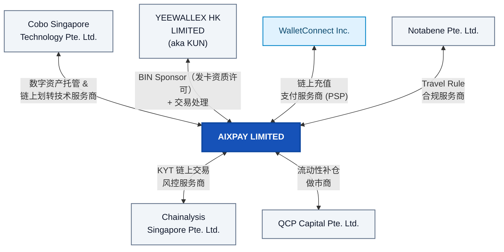

## 三、角色与职责（Roles & Responsibilities）

**AIXPAY LIMITED** 作为核心运营主体，与用户直接建立产品与服务法律关系（T&C + Privacy Policy），并分别与下列**法定主体**通过商业合同与技术集成对接，组合形成完整的数字资产账户与卡支付能力栈。

**生态关系总览**：

**各方角色与职责详述**：

| 主体                                      | 角色标签                                                          | 职责范围与边界                                                                                                                                                                                                                                                                                                        |
| --------------------------------------- | ------------------------------------------------------------- | -------------------------------------------------------------------------------------------------------------------------------------------------------------------------------------------------------------------------------------------------------------------------------------------------------------- |
| **Cobo Singapore Technology Pte. Ltd.** | Digital Asset Custody & On-Chain Transfer Technology Provider | 为 AIX 提供**数字资产托管**基础设施：私钥管理（MPC 多方计算）、充值地址生成、链上转账执行（含 Gas 管理）、余额快照与 Webhook 通知。AIX 通过 API 向 Cobo 下发转账指令，Cobo 负责签名广播并回传链上确认。双方通过**日终对账**（AIX Ledger 账本 vs Cobo 余额报告）保证账实一致。**私钥始终不离开 Cobo 侧**。                                                                                                                  |
| **YEEWALLEX HK LIMITED（aka KUN）**       | Card BIN Sponsorship + Processing                             | 作为 AIX 的**卡业务核心合作方**，提供三重能力：① **BIN Sponsorship**——以 KUN 持有的发卡牌照为 AIX 用户发行 Visa / Mastercard 卡片（虚拟卡 + 实体卡）；② **Card Processing**——处理实时授权（Auth）、清算（Clearing）、结算（Settlement）等卡网络交互，AIX 作为 Online Issuer 提供授权决策；③ **KYC 协同入口**——KUN 整合 AAI 身份核验能力，AIX App 通过 SDK 直连 AAI 采集证件/人脸（敏感数据不经 AIX 后台），KUN 输出最终合规结论给 AIX。 |
| **Chainalysis Singapore Pte. Ltd.**     | KYT Technology Provider                                       | 为 AIX 提供 **KYT（Know Your Transaction）** 能力：对链上地址与交易进行风险评分（Risk Score）、制裁名单匹配（OFAC / EU / UN）、黑名单筛查。AIX 在用户充值到账与提现发起时调用 Chainalysis API，根据返回的风险等级决定放行、人工审核或拒绝。评分规则阈值由 AIX 合规团队配置。                                                                                                                               |
| **WalletConnect Inc.**                  | On-chain deposit PSP                                          | 作为**链上入金**路径上的 **PSP（Payment Service Provider）** 能力提供方，为用户提供从外部钱包向 AIX 充值地址转入数字资产时的连接与交互体验（如 WalletConnect 协议支持的多钱包扫码连接）。AIX 平台侧集成该通道能力，具体产品形态随链与钱包生态演进调整。                                                                                                                                                     |
| **Notabene Pte. Ltd.**                  | Travel Rule Technology Provider                               | 为 AIX 提供 **Travel Rule** 合规能力：在用户链上充值/提现时，按 FATF 要求与对手方 VASP 交换 **IVMS101** 格式的发起方/受益方信息。Notabene 负责对手方 VASP 发现（Discovery）、报文路由与加密传输。AIX 作为 Originating / Beneficiary VASP 发起或响应合规报文，超时未响应的交易按 AIX 内部策略降级处理。                                                                                                   |
| **QCP Capital Pte. Ltd.**               | Liquidity Partner                                             | 作为 AIX 在**流动性补仓**场景下的 **做市商**：提供实时汇率报价、执行大额换汇、完成 Crypto 划转至 AIX 企业账户。用于支撑平台侧的 B2B 资金清算与备付金补充。AIX 承担报价锁定期后的汇率波动风险。                                                                                                                                                                                              |

