## 四、核心业务流与系统交互 (Main Business Flows)

本章节详细定义了 AIX Phase 2 面向用户的 10 条核心业务旅程。每条流程均明确了参与方、信息流（实线）与资金流（虚线）的交互顺序，以及关键的系统约束。

### 4.1 客户核心旅程 (Customer-Facing Flows)

#### Flow 1：Account Opening & KYC（开户与身份认证）

**核心逻辑**：用户经 App 提交开户审核；AIX Platform 向 KUN 请求身份核验服务。证件、人脸、地址证明由 **AIX App 经 SDK/H5 直连 AAI** 上传，**不经 AIX Platform 后台**。AAI 将**采集结果**回传 KUN，由 **KUN 输出审核结论**（通过/拒绝）并通知平台；平台侧**开通账户功能**（实现上与 **AIX Ledger** 协同记账，见系统边界与第三章）。App 向用户展示最终开户结果。

**业务交互结构图（Mermaid `flowchart`）**：参与方方块 + 编号箭头，便于业务/管理层一眼看清系统边界与数据走向（**④** 为虚线表示敏感数据不经 Platform）。

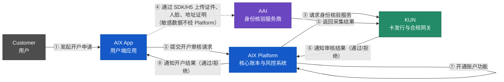

**系统时序图（Mermaid `sequenceDiagram`）**：与上图**同一套 8 步**，按时间先后展开，便于研发/集成对齐消息顺序与责任边界。

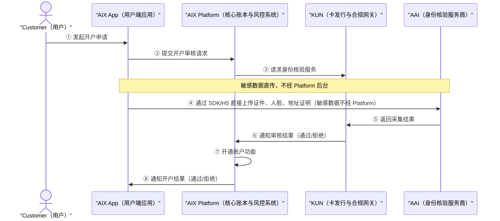

> **图注（两图共用）**：**④** 为 **App → AAI** 直连采集，**不经 AIX Platform 后台**；**KYC 合规结论由 KUN 给出**；**⑦** 为 Platform 侧内部动作。客户余额由 **AIX Ledger** 记账（与第三章一致）。原 `flow-1-account-opening--kyc-v0.3.drawio` 已废止，以本组 Mermaid 为准。

**关键约束**：
- **敏感数据隔离**：证件原件与人脸等仅由 AAI/KUN 侧按约定留存；AIX 保存结论与脱敏状态，降低合规存储压力。
- **职责边界**：AIX Platform **不做** KYC 风险评判；审核结论以 KUN 通知为准。
- **状态机同步**：须处理 KUN 侧中间状态（如 `PENDING`、`IN_REVIEW`），并支持断点续传。

#### Flow 2：Card Application & Issuance（卡片申请与发卡）

**核心逻辑**：AIX Platform 全程负责申卡流程编排；AIX Ledger 负责手续费冻结与结算。KUN 将开卡请求路由至 Issue（实际发卡处理商），Issue 完成内部合规审核后逐级回传结果。手续费通过 Cobo MPC 钱包在链上从资金池划转至手续费账户完成物理结算。实体卡申请同步触发制卡商制卡与物流商寄送流程。

**业务交互结构图（Mermaid `flowchart`）**：采用五列式布局（用户 → AIX 核心 → 外部网关 → 执行层 → 供应链），确保业务动线清晰、交叉线最少。**①–⑲** 与下方时序图一致。

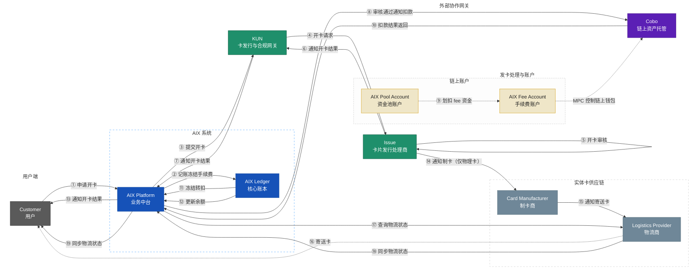

**系统时序图（Mermaid `sequenceDiagram`）**：与结构图同一流程的泳道视角（步骤编号与结构图 ①–⑲ 对应关系见关键约束）。

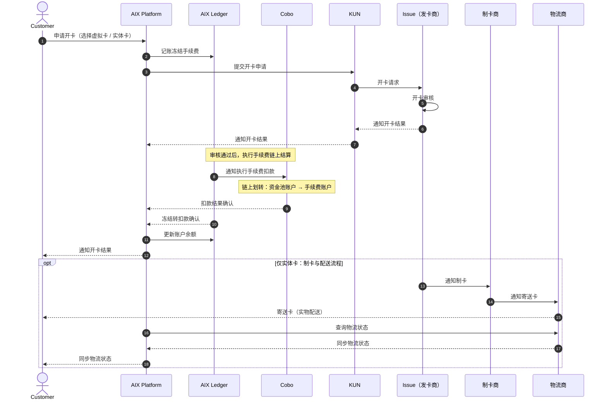

**关键约束**：
- **职责分离**：AIX Platform 负责业务编排（验资格、调 KUN、触发结算）；AIX Ledger 负责所有账本操作（冻结手续费②、指令 Cobo⑧、记录冻结转扣⑪、更新余额⑫）。
- **PCI 合规隔离**：AIX Platform 后端仅存储 `Card ID` 和脱敏卡号。明文 PAN/CVV 由客户端直接向 KUN 获取，不经过 AIX 后台。
- **手续费链上结算**：开卡费通过 Cobo MPC 钱包从资金池划转至手续费账户，实现客户备付金与公司收入的物理隔离。
- **实体卡配送追踪**：Issue 触发制卡商制卡后，AIX Platform 主动查询物流状态并同步给用户。

#### Flow 3：On-chain Deposit with KYT & Travel Rule（链上充值与合规流程）

**核心逻辑**：先检测入账，后执行合规审查（KYT/TR），全部通过后才在 AIX 账本记账。资金物理归集（Sweeping）异步进行。

**业务交互结构图（Mermaid `flowchart`）**：采用中台枢纽布局，清晰展示从链上入账、合规校验到账本正式扣款的全链路。**1–13** 与下方逻辑一致。

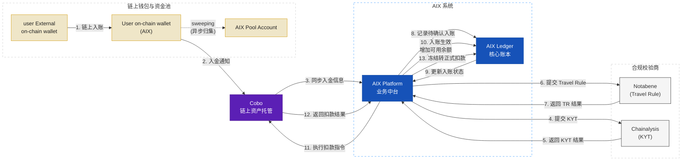

**系统时序图（Mermaid `sequenceDiagram`）**：

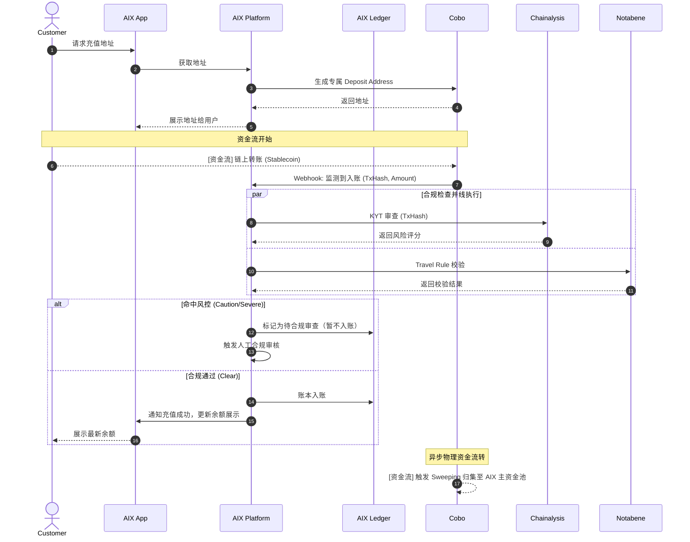

**关键约束**：
- **Deposit Escrow**：合规未通过的资金停留在 Cobo 资金池，绝对不映射到用户账本余额。
- **异步 Sweeping**：物理资金归集不阻塞用户账本加钱，提升用户体验。

#### Flow 4：On-chain Withdrawal with Travel Rule（链上提现与合规流程）

**核心逻辑**：严格遵循"先冻结账本，后下发打钱指令"原则。资金从公共提现热钱包（Withdrawal Wallet）流出。

**业务交互结构图（Mermaid `flowchart`）**：采用"五列式"布局，展示从发起提现、账本冻结、合规校验到链上转账的完整 11 步流程。

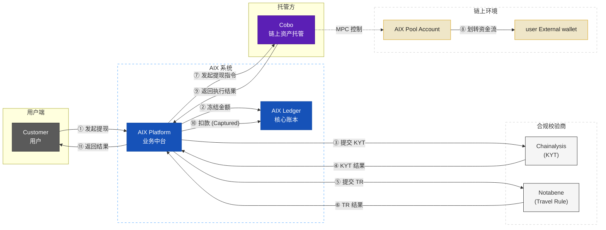

**系统时序图（Mermaid `sequenceDiagram`）**：

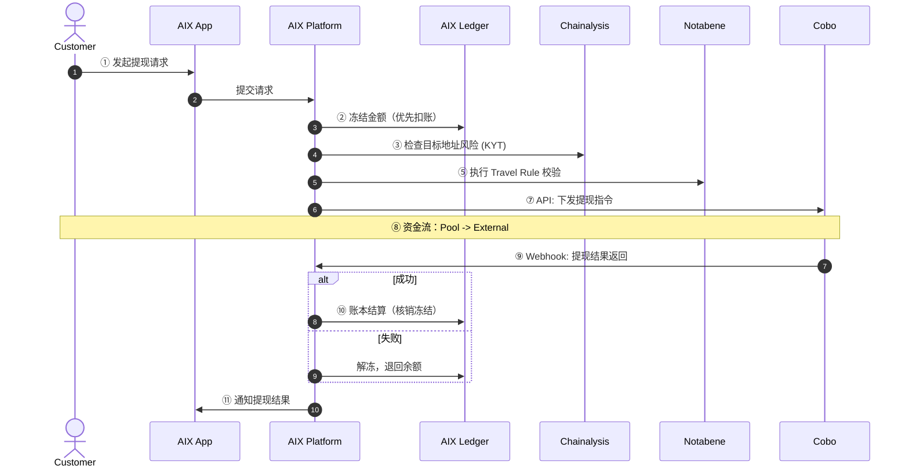

**关键约束**：
- **Hold before Send**：必须先扣账本再发链上指令，防止超额提现。
- **公共热钱包出款**：避免用户充值地址的 Gas费管理灾难，集中流动性。

#### Flow 5：Fiat Payout (Off-ramp)（法币出金）

**核心逻辑**：用户侧扣除 Crypto 余额，Payout Rail 垫付本地法币。B2B 资金结算异步进行。

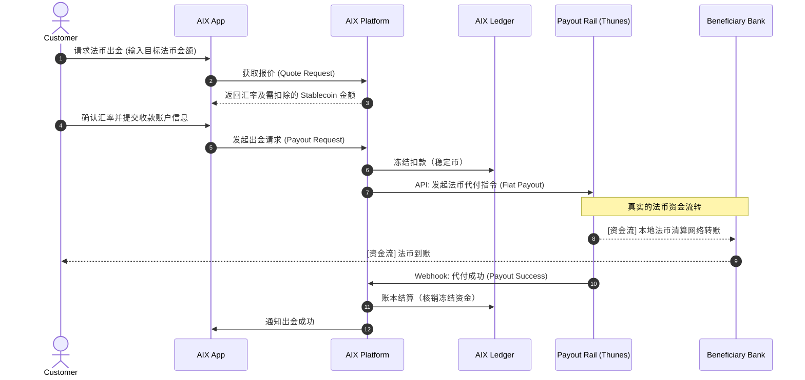

**关键约束**：
- **资金流隔离**：此流程无 Crypto 链上转账，AIX 仅扣内部账本，法币由供应商垫付。
- **汇率锁定**：报价具有极短有效期（如 15 秒），超时需重新获取。

#### Flow 6：Card Transaction (Auth & Capture)（刷卡消费：授权与清算）

**核心逻辑**：毫秒级实时授权（Auth）冻结资金，T+1 异步清算（Capture）结算差额。阶段三资金结算中，AIX 通过 Cobo（链上托管执行方）将稳定币转出至 Issuer Settlement Wallet，后续法币清算由传统卡网络完成。

**业务交互结构图（Mermaid `flowchart`）**：采用清晰的五阶段布局（授权、请款、清算、资金补足、最终结算），明确各参与方职责边界。

```mermaid
flowchart LR
    Customer["Customer<br/>用户"]
    Merchant["Merchant<br/>商户"]
    Acquirer["Acquirer<br/>收单行"]
    CardNetwork["Card Network<br/>Visa / MC"]

    subgraph IssuerSide[" 发卡侧与网关 "]
        direction TB
        KUN["KUN<br/>Issuer Gateway"]
        IssuerBank["Issuer Funding Channel<br/>发卡侧资金通道"]
        IssuerFloat["Issuer Float Account<br/>发卡侧备付资金"]
    end

    subgraph AIX[" AIX 系统 "]
        direction TB
        Platform["AIX Platform<br/>业务中台"]
        Ledger["AIX Ledger<br/>核心账本"]
    end

    subgraph Custody[" 链上托管 "]
        direction TB
        Pool["AIX Pool Account<br/>主资金池"]
        Cobo["Cobo<br/>链上资产托管执行"]
    end

    %% =========================
    %% Phase 1: Authorization
    %% =========================
    Customer -->|1. 发起交易| Merchant
    Merchant -->|2. Auth 请求| Acquirer
    Acquirer -->|3. 转发 Auth| CardNetwork
    CardNetwork -->|4. 路由至发卡侧| KUN
    KUN -->|5. 转发 Auth| Platform
    Platform -->|6. Hold（冻结金额）| Ledger
    Platform -->|7. Auth 决策| KUN
    KUN -->|8. 回传 Auth| CardNetwork
    CardNetwork -->|9. 返回结果| Acquirer
    Acquirer -->|10. 通知商户| Merchant

    %% =========================
    %% Phase 2: Capture
    %% =========================
    Merchant -->|11. Capture（商户请款）| Acquirer
    Acquirer -->|12. 提交 Capture| CardNetwork

    %% =========================
    %% Phase 3: Clearing
    %% =========================
    CardNetwork -->|13. 下发 Clearing Record| KUN
    KUN -->|14. 转发 Clearing 数据| Platform
    Platform -->|15. Capture / Adjust（账本正式扣账）| Ledger

    %% =========================
    %% Phase 4: Funding
    %% =========================
    Platform -->|16. Funding Instruction| Cobo
    Pool -.->|17. 由 Cobo 执行资金池出金| Cobo
    Cobo -->|18. 经外部兑换 / 银行通道接入 issuer funding| IssuerBank
    IssuerBank -->|19. 资金补足至 Issuer Float| IssuerFloat

    %% =========================
    %% Phase 5: Settlement（关键修正）
    %% =========================
    CardNetwork -->|20. 发起 Settlement Cycle（结算周期触发）| IssuerFloat
    IssuerFloat -.->|21. Settlement 执行（资金清算）| CardNetwork

    %% ============================================================
    %% 样式美化
    %% ============================================================
    classDef user fill:#5a5a5a,stroke:#333,color:#fff;
    classDef aix fill:#1652b8,stroke:#0d47a1,color:#fff;
    classDef external fill:#1f8f6b,stroke:#155d45,color:#fff;
    classDef custody fill:#5b1fb5,stroke:#4a148c,color:#fff;
    classDef wallet fill:#efe6c8,stroke:#d6a11a,color:#222;

    class Customer,Merchant user;
    class Acquirer,CardNetwork,IssuerBank,IssuerFloat external;
    class KUN external;
    class Platform,Ledger aix;
    class Cobo custody;
    class Pool wallet;

    %% 容器样式
    style IssuerSide fill:#f9f9f9,stroke:#1f8f6b,stroke-width:2px,stroke-dasharray: 5 5
    style AIX fill:#f0f7ff,stroke:#1652b8,stroke-width:2px,stroke-dasharray: 5 5
    style Custody fill:#f5f0ff,stroke:#5b1fb5,stroke-width:2px,stroke-dasharray: 5 5
```

**系统时序图（Mermaid `sequenceDiagram`）**：

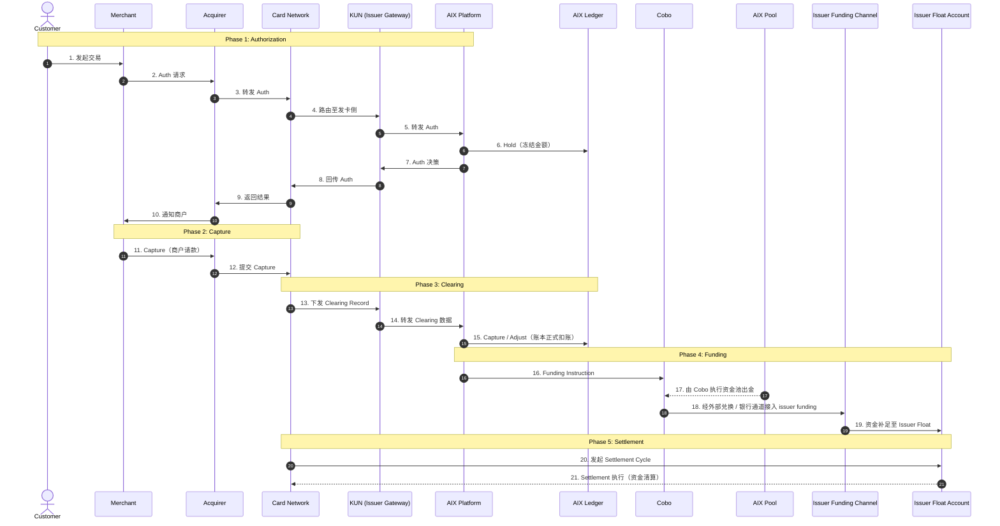


**关键约束**：
- **极严苛 SLA**：AIX 处理 Auth Webhook 必须在 < 200ms 内完成，否则 KUN 将触发降级 STIP 逻辑。
- **差额处理**：必须妥善处理 Auth 与 Capture 之间的汇率滑点、小费或预授权差额。
- **角色隔离**：KUN 仅承担信息流网关（Auth/Capture 的转发与回传），不参与资金结算。Cobo 作为链上托管执行方负责稳定币转出（Fund Out），`Issuer Settlement Wallet` 归属待业务确认。

#### Flow 7：Card Refund & Dispute（退款与争议处理）

**核心逻辑**：退款和争议均为异步流程。退款由商户发起，争议（Chargeback）由用户发起。AIX Platform 负责流程编排、账本更新及资金对齐。

**场景 A：商户主动退款 (Refund)**

**业务交互结构图（Mermaid `flowchart`）**：展示从商户发起退款到 AIX 账本更新及资金回补的完整 12 步闭环。

```mermaid
flowchart LR
    %% =========================
    %% User / Merchant Side
    %% =========================
    User["Customer<br/>用户"]
    Merchant["Merchant<br/>商户"]
    Acquirer["Acquirer<br/>收单行"]
    CardNetwork["Card Network<br/>Visa / MC"]

    %% =========================
    %% Issuer / Gateway Side
    %% =========================
    subgraph IssuerSide_R[" 卡退款处理链路 "]
        direction TB
        KUN_R["KUN<br/>Issuer Gateway"]
        IssuerBank_R["Issuer Bank /<br/>Settlement System"]
        IssuerFloat_R["Issuer Float Account<br/>发卡侧备付资金"]
        AIXTreasury_R["AIX Treasury Account<br/>AIX 财库账户"]
    end

    %% =========================
    %% AIX Side
    %% =========================
    subgraph AIX_R[" 用户侧与 AIX 侧 "]
        direction TB
        Platform_R["AIX Platform<br/>业务中台"]
        Ledger_R["AIX Ledger<br/>核心账本"]
        UserView_R["User Refund Result<br/>用户侧退款结果"]
    end

    %% =========================
    %% Refund Main Flow
    %% =========================
    User -->|1. 向商户申请退款| Merchant
    Merchant -->|2. 发起 Refund 请求| Acquirer
    Acquirer -->|3. 提交退款清算信息| CardNetwork
    CardNetwork -->|4. 退款信息发送至发卡侧| KUN_R
    KUN_R -->|5. Refund Webhook| Platform_R
    Platform_R -->|6. 关联原交易并确认退款金额| Platform_R

    %% =========================
    %% Ledger Update / User Visible Result
    %% =========================
    Platform_R -->|7. 给用户入账 / 更新余额| Ledger_R
    Platform_R -->|8. 更新退款结果状态| UserView_R

    %% =========================
    %% Refund Funding / Reconciliation
    %% =========================
    CardNetwork -.->|9. Card Network 下发退款清算信息| IssuerBank_R
    IssuerBank_R -->|10. 退款资金结算至 Issuer Float| IssuerFloat_R
    IssuerFloat_R -->|11. 退款资金回补至 AIX Treasury| AIXTreasury_R
    AIXTreasury_R -.->|12. 完成账务与资金对齐| Ledger_R

    %% ============================================================
    %% 样式美化
    %% ============================================================
    classDef user fill:#5a5a5a,stroke:#333,color:#fff;
    classDef aix fill:#1652b8,stroke:#0d47a1,color:#fff;
    classDef external fill:#1f8f6b,stroke:#155d45,color:#fff;
    classDef wallet fill:#efe6c8,stroke:#d6a11a,color:#222;

    class User,Merchant user;
    class Acquirer,CardNetwork,IssuerBank_R,IssuerFloat_R external;
    class KUN_R external;
    class Platform_R,Ledger_R aix;
    class AIXTreasury_R,UserView_R wallet;

    %% 容器样式
    style IssuerSide_R fill:#f9f9f9,stroke:#1f8f6b,stroke-width:2px,stroke-dasharray: 5 5
    style AIX_R fill:#f0f7ff,stroke:#1652b8,stroke-width:2px,stroke-dasharray: 5 5
```

**场景 B：用户发起争议 (Dispute / Chargeback)**

**业务交互结构图（Mermaid `flowchart`）**：展示从用户发起争议、卡组织调单举证到最终资金回补的 15 步闭环。

```mermaid
flowchart LR
    %% =========================
    %% User / AIX Side
    %% =========================
    User_D["Customer<br/>用户"]
    Platform_D["AIX Platform<br/>业务中台"]
    Ledger_D["AIX Ledger<br/>核心账本"]

    %% =========================
    %% Dispute / Chargeback Processing
    %% =========================
    subgraph DisputeFlow[" 卡争议处理链路 "]
        direction TB
        KUN_D["KUN<br/>Issuer Gateway"]
        CardNetwork_D["Card Network<br/>Visa / MC"]
        Acquirer_D["Acquirer<br/>收单行"]
        Merchant_D["Merchant<br/>商户"]
    end

    %% =========================
    %% Funding Reconciliation
    %% =========================
    subgraph Funding_D[" 资金清算与回补链路 "]
        direction TB
        IssuerBank_D["Issuer Bank /<br/>Settlement System"]
        IssuerFloat_D["Issuer Float Account<br/>发卡侧备付资金"]
        AIXTreasury_D["AIX Treasury Account<br/>AIX 财库账户"]
    end

    %% =========================
    %% Dispute Main Flow
    %% =========================
    User_D -->|"1. 发起争议 (Dispute)"| Platform_D
    Platform_D -->|"2. 发起 Chargeback (如满足条件)"| KUN_D

    KUN_D -->|"3. 提交 Chargeback"| CardNetwork_D
    CardNetwork_D -->|"4. 下发至收单侧"| Acquirer_D
    Acquirer_D -->|"5. 通知商户应诉"| Merchant_D
    Merchant_D -->|"6. 提交举证材料"| Acquirer_D
    Acquirer_D -->|"7. 回传举证材料"| CardNetwork_D
    CardNetwork_D -->|"8. 返回 Chargeback 结果"| KUN_D
    KUN_D -->|"9. Result Webhook"| Platform_D

    %% =========================
    %% Funding / Reconciliation
    %% =========================
    CardNetwork_D -.->|"10. Card Network 下发争议清算信息"| IssuerBank_D
    IssuerBank_D -->|"11. 争议资金结算至 Issuer Float"| IssuerFloat_D
    IssuerFloat_D -->|"12. 资金回补至 AIX Treasury"| AIXTreasury_D

    %% =========================
    %% AIX Ledger Update
    %% =========================
    Platform_D -->|"13. 根据结果给用户入账 / 调整余额"| Ledger_D
    AIXTreasury_D -.->|"14. 完成争议账务与资金对齐"| Ledger_D

    %% ============================================================
    %% 样式美化
    %% ============================================================
    classDef user fill:#5a5a5a,stroke:#333,color:#fff;
    classDef aix fill:#1652b8,stroke:#0d47a1,color:#fff;
    classDef external fill:#1f8f6b,stroke:#155d45,color:#fff;
    classDef wallet fill:#efe6c8,stroke:#d6a11a,color:#222;

    class User_D,Merchant_D user;
    class Acquirer_D,CardNetwork_D,IssuerBank_D,IssuerFloat_D external;
    class KUN_D external;
    class Platform_D,Ledger_D aix;
    class AIXTreasury_D wallet;

    %% 容器样式
    style DisputeFlow fill:#f9f9f9,stroke:#1f8f6b,stroke-width:2px,stroke-dasharray: 5 5
    style Funding_D fill:#f5f0ff,stroke:#5b1fb5,stroke-width:2px,stroke-dasharray: 5 5
```

**系统时序图（Mermaid `sequenceDiagram`）**：

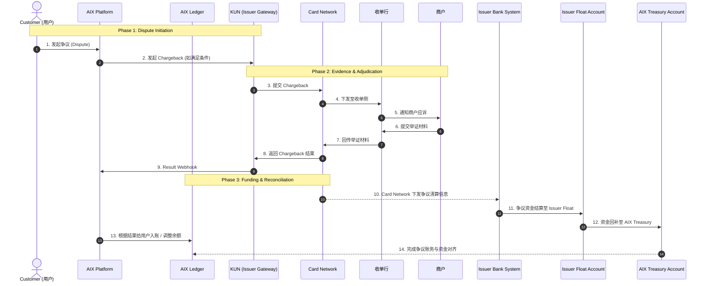

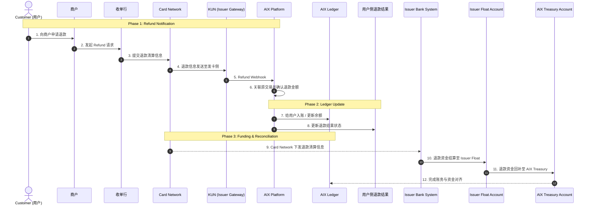

**关键约束**：
- **汇率风险**：退款汇率按清算日计算，退回的 Stablecoin 数量可能与消费时不同。
- **部分退款**：需支持同一笔原交易对应多次的部分退款 Webhook。

#### Flow 8：Card Management (Freeze, Unfreeze, Replace)（卡片管理）

**核心逻辑**：支持用户主动通过 App 进行卡片生命周期管理（激活、设置/修改 PIN、锁定/解锁、换卡）。AIX Platform 负责业务编排与 KUN 对接，AIX Ledger 负责换卡时的账户绑定迁移。

**业务交互结构图（Mermaid `flowchart`）**：展示从用户发起操作到 KUN 执行及账本同步的完整链路。

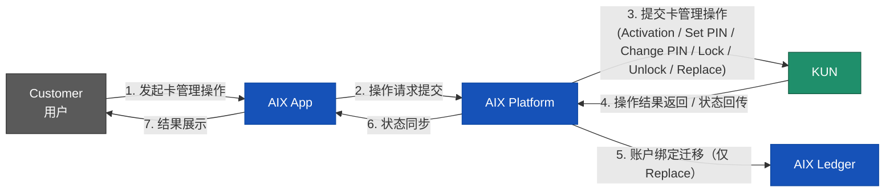

**系统时序图（Mermaid `sequenceDiagram`）**：支持用户主动冻结与发卡方/风控被动冻结的双向状态同步。换卡时旧卡注销，新卡继承原资金账户。

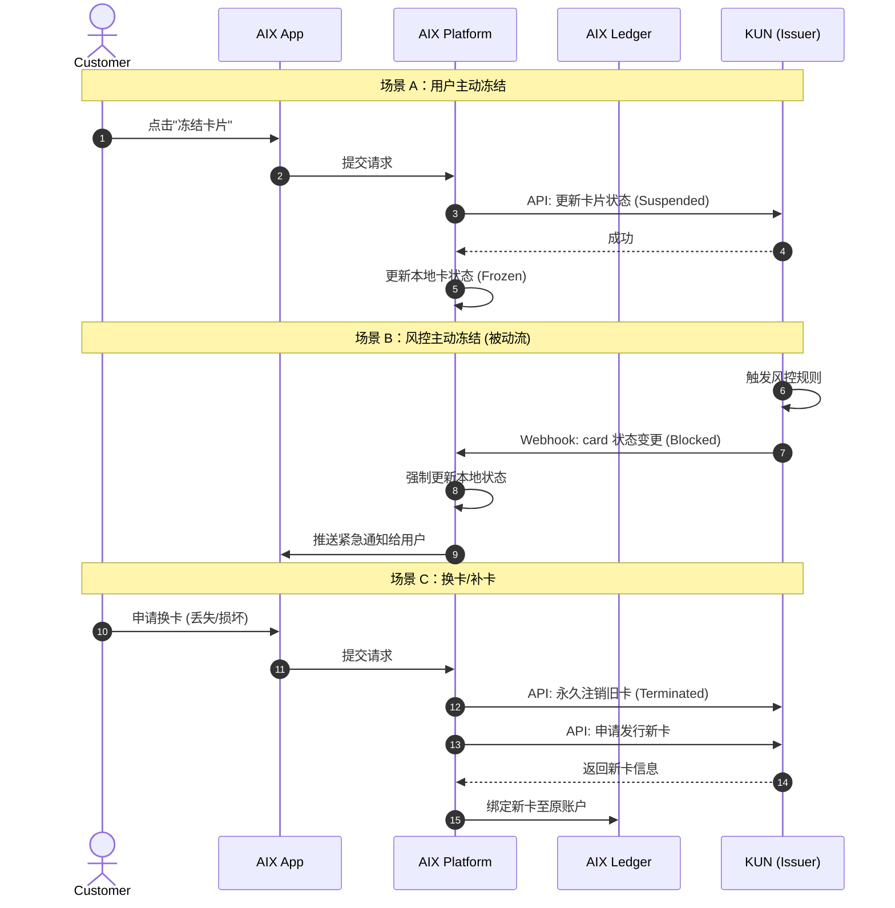

**关键约束**：
- **状态机映射**：AIX 必须维护与 KUN 兼容的卡片状态机，并处理状态转换的合法性。
- **在途交易**：卡片冻结后，拒绝新 Auth，但已授权的 Capture 仍需正常结算扣款。

### 4.2 产品能力层 (Product Capability Flows)

#### Flow 9：Token Swapping (Internal)（内部代币兑换）

**核心逻辑**：零 Gas 费、秒级成交的内部账本转换，不发生真实链上交易。AIX 充当做市商赚取点差。当内部库存低于阈值时，触发外部补仓流程。

**业务交互结构图（Mermaid `flowchart`）**：展示了从用户发起兑换到内部账本更新，以及异步外部补仓的四层架构。

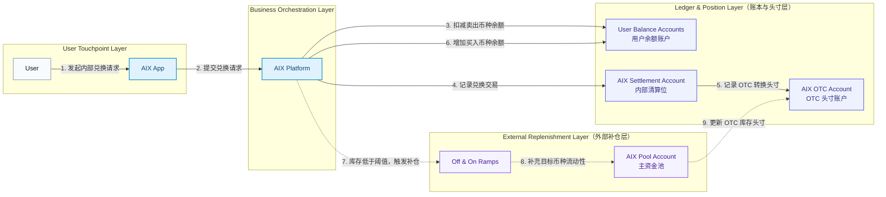

**系统时序图（Mermaid `sequenceDiagram`）**：展示了报价锁定与原子兑换的时间线。

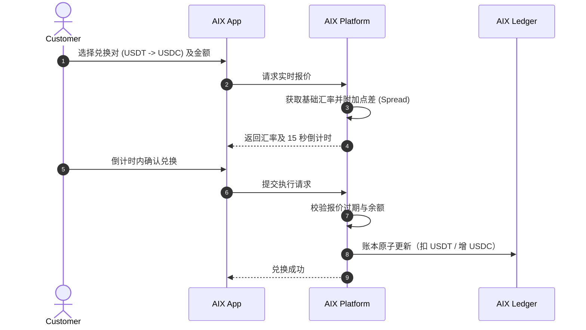

**关键约束**：
- **防套利机制**：报价必须有严格的 TTL（如 15 秒），超时拒绝。
- **原子操作**：双币种的增减必须在同一数据库事务中完成。
- **库存管理**：AIX OTC 账户需实时监控各币种头寸，确保内部流动性充足。

#### Flow 10：Yield Subscription / Redemption（生息产品的申购与赎回）

**核心逻辑**：用户侧实现“活期秒退”的账本划转，平台侧通过资金池缓冲（Liquidity Buffer）异步投资底层资产。AIX Platform 负责业务编排，AIX Ledger 负责钱包与收益账户的映射记账。

**业务交互结构图（Mermaid `flowchart`）**：展示了从用户申赎请求到内部账本映射，以及异步外部调仓与资金流转的完整链路。

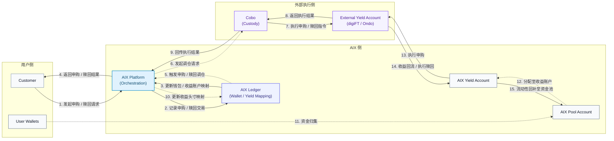

**系统时序图（Mermaid `sequenceDiagram`）**：展示了申购、计息与赎回的三种典型场景。

```mermaid
sequenceDiagram
    autonumber
    actor Customer
    participant App as AIX App
    participant AIX as AIX Platform
    participant Ledger as AIX Ledger
    participant Treasury as AIX Treasury
    participant Provider as Yield Provider

    Note over Customer, AIX: 场景 A：申购 (实时账本划转)
    Customer->>App: 提交申购请求
    App->>AIX: 申购请求
    AIX->>Ledger: 扣减 Wallet Balance，增加 Yield Balance
    
    Note over AIX, Ledger: 场景 B：每日计息 (批处理)
    AIX->>Ledger: 计算收益，发放至余额
    
    Note over Customer, AIX: 场景 C：赎回 (活期秒退)
    Customer->>App: 提交赎回请求
    alt 备付金充足
        AIX->>Ledger: 扣减 Yield Balance，增加 Wallet Balance
    else 触发大额限制
        AIX->>AIX: 挂起请求，等待底层清算 (T+1)
    end

    Note over Treasury, Provider: 异步动作：底层资金 B2B 投资
    Treasury->>Treasury: 汇总净申购/赎回敞口
    Treasury-->>Provider: [资金流] 每日定时打款或提现
```

**关键约束**：
- **资金池模式**：底层资产方仅对接 AIX 机构账户，不感知散户。
- **消费隔离**：`Yield Balance` 不能直接用于刷卡消费，必须先赎回到 `Wallet Balance`。
- **流动性缓冲**：平台需维持一定比例的 `Pool Account` 余额，以支持散户的实时赎回需求。
- **调仓周期**：外部 B2B 调仓通常为 T+1 或定时批处理，与散户端的 T+0 体验通过内部账本解耦。
