## 五、核心业务流与系统交互 (Main Business Flows)

### 5.1 客户核心旅程 (Customer-Facing Flows)

#### Flow 1：Account Opening & KYC（开户与身份认证）

**核心逻辑**：用户经 App 提交开户审核；AIX Platform（业务中台）向 KUN（Issuer Gateway）请求身份核验服务。证件、人脸、地址证明由 AIX App 采集并上传，由 KUN 输出审核结论并通知平台；平台侧在审核通过后联动 AIX Ledger（核心账本）开立用户账户。App 向用户展示最终开户结果。

**业务交互结构图（Mermaid `flowchart`）**：展示系统边界与数据走向。

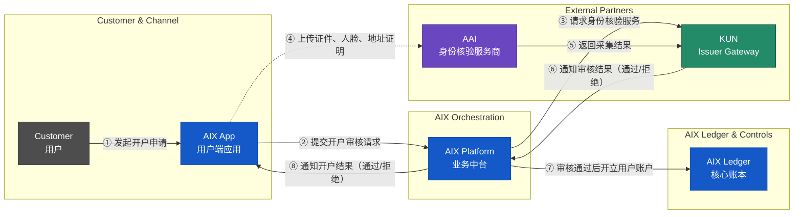

#### Flow 2：Card Application & Issuance（卡片申请与发卡）

**核心逻辑**：AIX Platform（业务中台）全程负责申卡流程编排；AIX Ledger（核心账本）负责开卡手续费的冻结与结算。KUN（Issuer Gateway）将开卡请求路由至 Issue（实际发卡处理商），Issue 完成内部合规审核后逐级回传结果。审核通过后，由 AIX Platform 调用 Cobo（Custody）执行物理资金划拨。实体卡申请同步触发制卡商制卡与物流商寄送流程。

**业务交互结构图（Mermaid `flowchart`）**：展示申卡申请、开卡审核、手续费结算以及实体卡物流追踪的完整闭环。

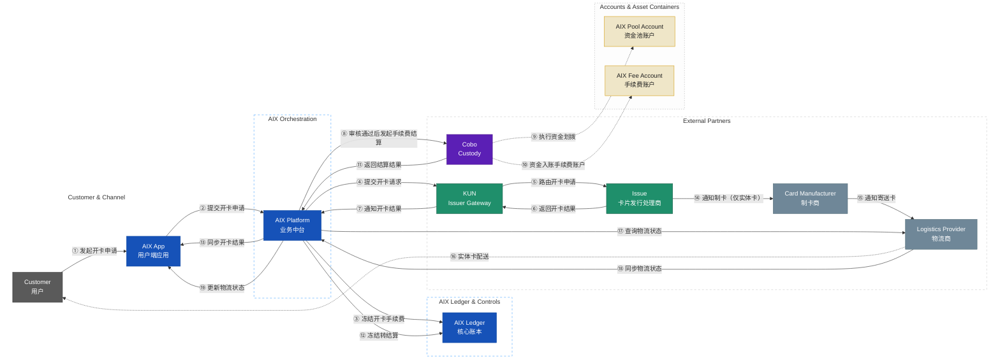

**关键约束**：

- **职责分离**：AIX Platform 负责业务串联（验资格、调 KUN、调用 Cobo 结算）；AIX Ledger 负责账本操作（冻结手续费③、记录冻结转结算⑫）。
- **实体卡配送追踪**：Issue 触发制卡商制卡后，AIX Platform 主动查询物流状态并同步给用户。

#### Flow 3：On-chain Deposit with KYT & Travel Rule（链上充值与合规流程）

**核心逻辑**：用户通过 WalletConnect 等协议向 AIX 专属充值地址发起转账。Cobo 监测入账后通知 AIX，AIX 独立调用 KYT/TR 插件进行合规审查；合规通过后由 AIX Ledger 正式 credit 用户余额。资金物理归集（Sweeping）异步进行。

**业务交互结构图（Mermaid `flowchart`）**：展示从地址申请、链上入账、合规校验到账本 credit 的完整链路。

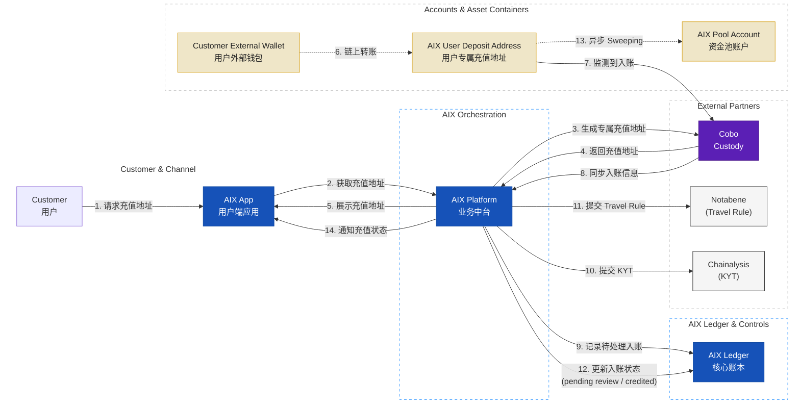

**关键约束**：

- **Deposit Escrow**：合规未通过或待人工复核的资金停留在 `pending review` 状态，不映射到用户可用余额。
- **异步 Sweeping**：物理资金归集不阻塞用户账本加钱。

#### Flow 4：On-chain Withdrawal with Travel Rule（链上提现与合规流程）

**核心逻辑**：严格遵循"先冻结账本，后下发打钱指令"原则。提现场景统一使用 `freeze / settle / unfreeze` 语义，资金从公共提现热钱包（Withdrawal Wallet）流出。

**业务交互结构图（Mermaid `flowchart`）**：展示从发起提现、账本冻结、合规校验到链上转账与账务结算的完整流程。

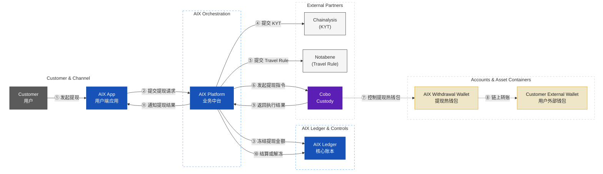

#### Flow 5：Card Transaction (Auth & Capture)（刷卡消费：授权与清算）

**核心逻辑**：毫秒级实时授权（Auth）执行 `hold`，T+1 异步清算（Capture）执行 `capture / release`。资金补足阶段，AIX 通过 Cobo（Custody）将稳定币从 `AIX Pool Account` 转出，经外部资金通道补足至 `Issuer Float Account`，后续法币清算由传统卡网络完成。

**业务交互结构图（Mermaid `flowchart`）**：展示授权、请款、清算、资金补足四个阶段。

```mermaid
flowchart LR
    subgraph CH[" Customer & Channel "]
        direction TB
        Customer["Customer<br/>用户"]
    end

    subgraph ORCH[" AIX Orchestration "]
        direction TB
        Platform["AIX Platform<br/>业务中台"]
    end

    subgraph CTRL[" AIX Ledger & Controls "]
        direction TB
        Ledger["AIX Ledger<br/>核心账本"]
    end

    subgraph EXT[" External Partners "]
        direction TB
        Merchant["Merchant<br/>商户"]
        Acquirer["Acquirer<br/>收单行"]
        CardNetwork["Card Network<br/>Visa / MC"]
        KUN["KUN<br/>Issuer Gateway"]
        Cobo["Cobo<br/>Custody"]
        IssuerBank["Issuer Funding Channel<br/>发卡侧资金通道"]
    end

    subgraph ACCT[" Accounts & Asset Containers "]
        direction TB
        Pool["AIX Pool Account<br/>主资金池"]
        IssuerFloat["Issuer Float Account<br/>发卡侧备付资金"]
    end

    Customer -->|1. 发起交易| Merchant
    Merchant -->|2. Auth 请求| Acquirer
    Acquirer -->|3. 转发 Auth| CardNetwork
    CardNetwork -->|4. 路由至发卡侧| KUN
    KUN -->|5. 转发 Auth| Platform
    Platform -->|6. Hold（冻结金额）| Ledger
    Platform -->|7. Auth 决策| KUN
    KUN -->|8. 回传 Auth| CardNetwork
    CardNetwork -->|9. 返回结果| Acquirer
    Acquirer -->|10. 通知商户| Merchant

    Merchant -->|11. Capture（商户请款）| Acquirer
    Acquirer -->|12. 提交 Capture| CardNetwork
    CardNetwork -->|13. 下发 Clearing Record| KUN
    KUN -->|14. 转发 Clearing 数据| Platform
    Platform -->|15. Capture / Adjust（账本正式扣账）| Ledger

    Platform -->|16. Funding Instruction| Cobo
    Cobo -.->|17. 从资金池转出稳定币| Pool
    Cobo -->|18. 经外部兑换 / 银行通道接入 issuer funding| IssuerBank
    IssuerBank -.->|19. 资金补足至 Issuer Float| IssuerFloat
    CardNetwork -.->|20. 发起 Settlement Cycle| IssuerFloat

    classDef user fill:#5a5a5a,stroke:#333,color:#fff;
    classDef aix fill:#1652b8,stroke:#0d47a1,color:#fff;
    classDef external fill:#1f8f6b,stroke:#155d45,color:#fff;
    classDef custody fill:#5b1fb5,stroke:#4a148c,color:#fff;
    classDef wallet fill:#efe6c8,stroke:#d6a11a,color:#222;

    class Customer,Merchant user;
    class Acquirer,CardNetwork,IssuerBank external;
    class KUN external;
    class Platform,Ledger aix;
    class Cobo custody;
    class Pool,IssuerFloat wallet;

    style CH fill:none,stroke:none
    style ORCH fill:none,stroke:#1652b8,stroke-width:2px,stroke-dasharray: 5 5
    style CTRL fill:none,stroke:#1652b8,stroke-width:2px,stroke-dasharray: 5 5
    style EXT fill:none,stroke:#1f8f6b,stroke-width:2px,stroke-dasharray: 5 5
    style ACCT fill:#fdfdfd,stroke:#bbb,stroke-dasharray: 3 3
```

#### Flow 6：Card Refund & Dispute（退款与争议处理）

**核心逻辑**：退款和争议均为异步流程。退款由商户发起，争议（Chargeback）由用户发起。AIX Platform 负责流程编排、账本更新及资金对齐。

**场景 A：商户主动退款 (Refund)**  
**业务含义**：退款是商户触发、发卡侧回传、AIX 先更新用户账务、后完成资金对齐的异步流程。

**业务交互结构图（Mermaid `flowchart`）**：展示从商户发起退款到 AIX 账本更新及资金回补的闭环。

```mermaid
flowchart LR
    subgraph CH[" Customer & Channel "]
        direction TB
        User["Customer<br/>用户"]
        App_R["AIX App<br/>用户端应用"]
    end

    subgraph ORCH[" AIX Orchestration "]
        direction TB
        Platform_R["AIX Platform<br/>业务中台"]
    end

    subgraph CTRL[" AIX Ledger & Controls "]
        direction TB
        Ledger_R["AIX Ledger<br/>核心账本"]
    end

    subgraph EXT[" External Partners "]
        direction TB
        Merchant["Merchant<br/>商户"]
        Acquirer["Acquirer<br/>收单行"]
        CardNetwork["Card Network<br/>Visa / MC"]
        KUN_R["KUN<br/>Issuer Gateway"]
        IssuerBank_R["Issuer Bank /<br/>Settlement System"]
    end

    subgraph ACCT[" Accounts & Asset Containers "]
        direction TB
        IssuerFloat_R["Issuer Float Account<br/>发卡侧备付资金"]
        AIXTreasury_R["AIX Pool Account<br/>主资金池"]
    end

    User -->|1. 向商户申请退款| Merchant
    Merchant -->|2. 发起 Refund 请求| Acquirer
    Acquirer -->|3. 提交退款清算信息| CardNetwork
    CardNetwork -->|4. 退款信息发送至发卡侧| KUN_R
    KUN_R -->|5. Refund Webhook| Platform_R
    Platform_R -->|6. 关联原交易并确认退款金额| Platform_R
    Platform_R -->|7. 给用户入账 / 更新余额| Ledger_R
    Platform_R -->|8. 更新退款结果状态| App_R
    CardNetwork -.->|9. Card Network 下发退款清算信息| IssuerBank_R
    IssuerBank_R -->|10. 退款资金结算至 Issuer Float| IssuerFloat_R
    IssuerFloat_R -->|11. 退款资金回补至 AIX Pool| AIXTreasury_R
    AIXTreasury_R -.->|12. 完成账务与资金对齐| Ledger_R

    classDef user fill:#5a5a5a,stroke:#333,color:#fff;
    classDef aix fill:#1652b8,stroke:#0d47a1,color:#fff;
    classDef external fill:#1f8f6b,stroke:#155d45,color:#fff;
    classDef wallet fill:#efe6c8,stroke:#d6a11a,color:#222;

    class User,Merchant user;
    class Acquirer,CardNetwork,IssuerBank_R external;
    class KUN_R external;
    class App_R,Platform_R,Ledger_R aix;
    class AIXTreasury_R,IssuerFloat_R wallet;

    style CH fill:none,stroke:none
    style ORCH fill:none,stroke:#1652b8,stroke-width:2px,stroke-dasharray: 5 5
    style CTRL fill:none,stroke:#1652b8,stroke-width:2px,stroke-dasharray: 5 5
    style EXT fill:none,stroke:#1f8f6b,stroke-width:2px,stroke-dasharray: 5 5
    style ACCT fill:#fdfdfd,stroke:#bbb,stroke-dasharray: 3 3
```

**场景 B：用户发起争议 (Dispute / Chargeback)**  
**业务含义**：争议是用户触发、平台判断是否满足发起条件、卡组织和收单侧完成举证裁定、AIX 再进行账务调整的异步流程。

**业务交互结构图（Mermaid `flowchart`）**：展示从用户发起争议到最终资金回补的闭环。

```mermaid
flowchart LR
    subgraph CH[" Customer & Channel "]
        direction TB
        User_D["Customer<br/>用户"]
        App_D["AIX App<br/>用户端应用"]
    end

    subgraph ORCH[" AIX Orchestration "]
        direction TB
        Platform_D["AIX Platform<br/>业务中台"]
    end

    subgraph CTRL[" AIX Ledger & Controls "]
        direction TB
        Ledger_D["AIX Ledger<br/>核心账本"]
    end

    subgraph EXT[" External Partners "]
        direction TB
        KUN_D["KUN<br/>Issuer Gateway"]
        CardNetwork_D["Card Network<br/>Visa / MC"]
        Acquirer_D["Acquirer<br/>收单行"]
        Merchant_D["Merchant<br/>商户"]
        IssuerBank_D["Issuer Bank /<br/>Settlement System"]
    end

    subgraph ACCT[" Accounts & Asset Containers "]
        direction TB
        IssuerFloat_D["Issuer Float Account<br/>发卡侧备付资金"]
        AIXTreasury_D["AIX Pool Account<br/>主资金池"]
    end

    User_D -->|"1. 发起争议 (Dispute)"| App_D
    App_D -->|"2. 提交争议申请"| Platform_D
    Platform_D -->|"3. 发起 Chargeback (如满足条件)"| KUN_D

    KUN_D -->|"4. 提交 Chargeback"| CardNetwork_D
    CardNetwork_D -->|"5. 下发至收单侧"| Acquirer_D
    Acquirer_D -->|"6. 通知商户应诉"| Merchant_D
    Merchant_D -->|"7. 提交举证材料"| Acquirer_D
    Acquirer_D -->|"8. 回传举证材料"| CardNetwork_D
    CardNetwork_D -->|"9. 返回 Chargeback 结果"| KUN_D
    KUN_D -->|"10. Result Webhook"| Platform_D

    CardNetwork_D -.->|"11. Card Network 下发争议清算信息"| IssuerBank_D
    IssuerBank_D -->|"12. 争议资金结算至 Issuer Float"| IssuerFloat_D
    IssuerFloat_D -->|"13. 资金回补至 AIX Pool"| AIXTreasury_D
    Platform_D -->|"14. 根据结果给用户入账 / 调整余额"| Ledger_D
    AIXTreasury_D -.->|"15. 完成争议账务与资金对齐"| Ledger_D
    Platform_D -->|"16. 通知争议结果"| App_D

    classDef user fill:#5a5a5a,stroke:#333,color:#fff;
    classDef aix fill:#1652b8,stroke:#0d47a1,color:#fff;
    classDef external fill:#1f8f6b,stroke:#155d45,color:#fff;
    classDef wallet fill:#efe6c8,stroke:#d6a11a,color:#222;

    class User_D,Merchant_D user;
    class Acquirer_D,CardNetwork_D,IssuerBank_D external;
    class KUN_D external;
    class App_D,Platform_D,Ledger_D aix;
    class AIXTreasury_D,IssuerFloat_D wallet;

    style CH fill:none,stroke:none
    style ORCH fill:none,stroke:#1652b8,stroke-width:2px,stroke-dasharray: 5 5
    style CTRL fill:none,stroke:#1652b8,stroke-width:2px,stroke-dasharray: 5 5
    style EXT fill:none,stroke:#1f8f6b,stroke-width:2px,stroke-dasharray: 5 5
    style ACCT fill:#fdfdfd,stroke:#bbb,stroke-dasharray: 3 3
```

#### Flow 7：Card Management (Freeze, Unfreeze, Replace)（卡片管理）

**核心逻辑**：支持用户主动通过 App 进行卡片生命周期管理（激活、设置/修改 PIN、锁定/解锁、换卡）。AIX Platform 负责业务编排与 KUN 对接，AIX Ledger 负责换卡时的账户绑定迁移。

**业务交互结构图（Mermaid `flowchart`）**：展示从用户发起操作到 KUN 执行及账本同步的完整链路。

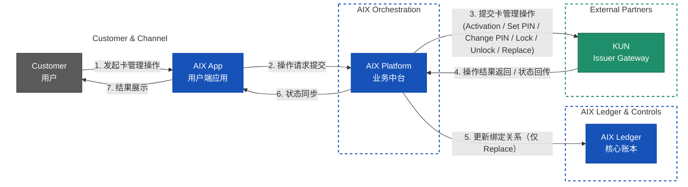

#### Flow 8：Token Swapping（内部代币兑换）

**核心逻辑**：零 Gas 费、秒级成交的内部账本转换，不发生真实链上交易。AIX Platform 负责报价与编排，AIX Ledger 负责原子记账并维护内部头寸账户。

**业务交互结构图（Mermaid `flowchart`）**：展示用户发起兑换到账本原子记账的实时链路。

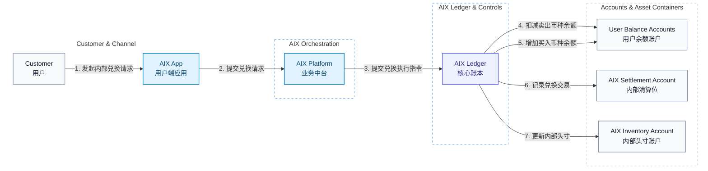

#### Flow 9：Yield Subscription / Redemption（生息产品的申购与赎回）

**核心逻辑**：用户侧实现“活期秒退”的账本划转，平台侧通过资金池缓冲（Liquidity Buffer）异步投资底层资产。AIX Platform 负责业务编排与调仓触发，AIX Ledger 负责钱包余额、收益余额与头寸状态的映射记账。

**业务交互结构图（Mermaid `flowchart`）**：展示用户账务侧与底层调仓侧的解耦链路。

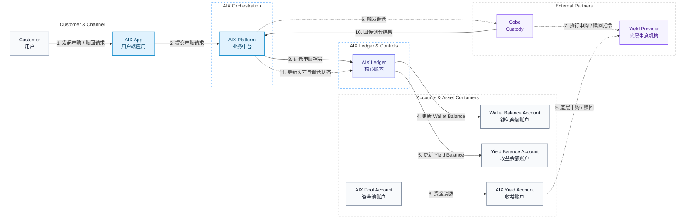

**关键约束**：

- **资金池模式**：底层资产方仅对接 AIX 机构账户，不感知散户。
- **消费隔离**：`Yield Balance` 不能直接用于刷卡消费，必须先赎回到 `Wallet Balance`。
- **流动性缓冲**：平台需维持一定比例的 `Pool Account` 余额，以支持散户的实时赎回需求。
- **调仓周期**：外部 B2B 调仓通常为 T+1 或定时批处理，与散户端的 T+0 体验通过内部账本解耦。

### 5.2 系统能力层 (System Capability Flows)

本节为对用户不可见的后台系统能力，支撑风控、流动性与账务一致性。

#### Flow 10：Inventory Rebalancing（头寸补仓）

**核心逻辑**：当内部头寸账户（Inventory Account）的某一币种余额低于安全阈值时，由平台侧自动或人工触发外部流动性补仓。该过程异步进行，不影响用户端的实时兑换体验。

**业务交互结构图（Mermaid `flowchart`）**：展示从头寸监控到外部补仓回写的系统后台链路。

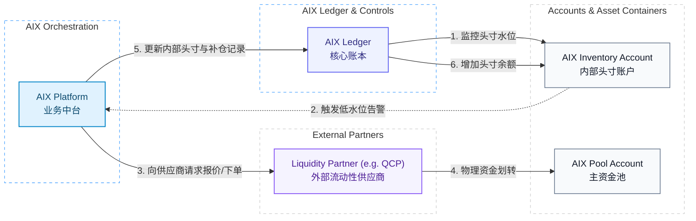

**关键约束**：
- **库存管理**：AIX 内部头寸账户需实时监控各币种库存，确保内部流动性充足。
