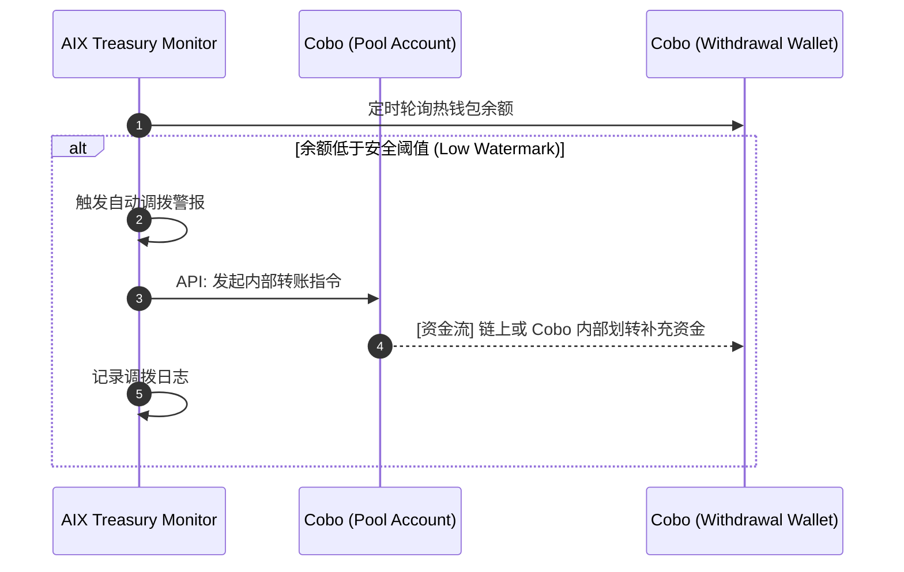
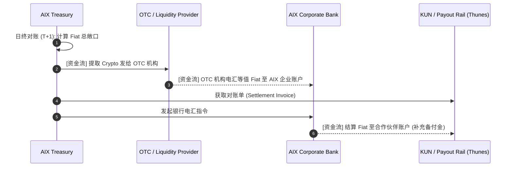
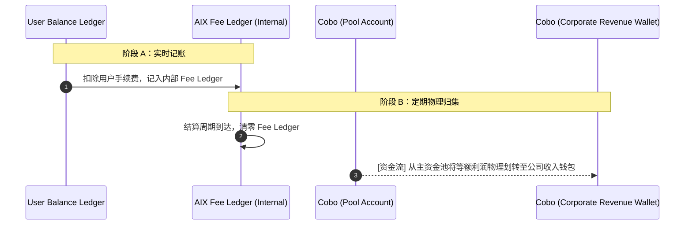

> **归档说明**：本文件为原「五、内部资金与流动性管理 (Internal Treasury Flows)」全文备份。  
> 该章节已从汇总稿 `solution-design.md` / `solution-design.html` 的装配列表中移除（不再纳入终稿目录）。  
> 归档日期以 Git 历史为准。

## 五、内部资金与流动性管理 (Internal Treasury Flows)

本章节定义了对用户透明，但对平台平稳运行至关重要的 3 条 B2B 资金管理流程。

#### Flow 11：Auto Top-up (Withdrawal Wallet Liquidity)（提现热钱包自动调拨）

**核心逻辑**：保证公共提现热钱包水位充足，同时控制热钱包资金敞口防范安全风险。

**关键约束**：
- **风控拦截**：设置单日最大自动调拨额度，超额必须转为人工多签（Multi-sig）审批，防止系统被劫持。

#### Flow 12：Treasury Settlement (B2B Fiat/Crypto Rebalancing)（B2B 资金清算与对冲）

**核心逻辑**：将用户消费扣除的 Crypto 兑换为 Fiat，用于向垫付法币的合作伙伴（KUN / Thunes）进行 B2B 结算或补充备付金。

**关键约束**：
- **汇率敞口**：用户消费汇率与 AIX 实际卖币汇率存在时间差，此汇率波动损益（P&L）由 AIX 承担。

#### Flow 13：Fee Collection & Revenue Sweeping（手续费收取与归集）

**核心逻辑**：将散落在各业务线（开卡费、提现费、Swap 点差）的利润，从客户资金池中物理剥离至公司收入账户，满足合规审计要求。

**关键约束**：
- **账实分离**：日常手续费仅为内部账本数字，必须通过定期的物理划转（Sweeping）实现公司自有资金与客户备付金（Client Funds）的严格隔离。
