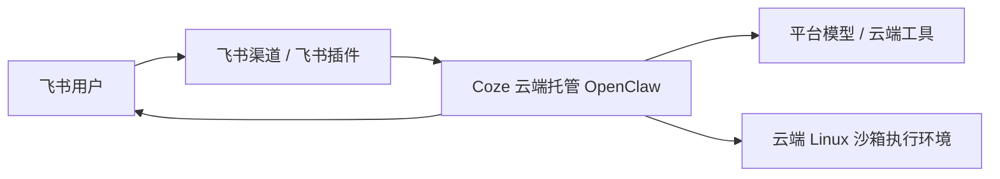

# 当前实际架构 vs 扣子编程部署 OpenClaw

这份文档回答两个问题：

1. 当前 `feishu-bridge` 仓库实际实现的架构是什么
2. 外部“扣子编程部署 OpenClaw”大致是什么形态，和当前方案有什么差别

---

## 一句话结论

当前仓库现在仍不是“飞书直接进 OpenClaw 插件”的最终直连形态，而是一个已经开始分层的中间态：

**飞书 -> feishu-bridge -> OpenClaw Gateway -> Cursor/其他执行器**

也就是说，当前已落地的是：

- `feishu-bridge` 仍然存在
- `feishu-ws-cursor.js` 已退化为兼容入口，真正装配在 `lib/feishu-channel/bridge-host.js`
- `feishu-bridge` 现在更像 **飞书通道宿主 / 兼容层**
- `OpenClaw` 才是当前代码里持续收拢中的 **控制平面**
- `Cursor` 是下游执行器，不直接接飞书

而外部“扣子编程部署 OpenClaw”更接近：

**飞书 -> 托管版 OpenClaw（扣子云端） -> 云端执行器 / 云端工具**

通常不会额外强调一层你们这种独立的 `feishu-bridge`

---

## 当前实际架构图


### 各层职责

#### 1. `feishu-bridge`

负责：

- 飞书 WebSocket 长连接
- 接收 `im.message.receive_v1`
- 解析文本、图片、语音、文件
- 处理群聊 `@bot`
- 处理引用父消息上下文
- 给飞书发 ACK / 最终回复

不负责：

- 最终的执行器编排决策
- 作为系统主大脑来选择全部执行链

#### 2. `bridge-host + pipeline v2`

桥内的中间层，负责：

- dedup 去重
- merge-forward 聚合
- group mention 过滤
- media 处理
- memory 组装
- reply 规范化
- 将飞书世界的消息整形成更稳定的任务输入
- 调 `openclaw-control-plane/*` 门面，而不是继续把策略散写在入口文件里

这层仍是 **Feishu 适配逻辑 + 迁移门面**，不是最终控制平面本体。

#### 3. `OpenClaw Gateway`

当前代码通过 `openclaw gateway call` 去调用网关 RPC，并开始归一化结构化结果（summary / artifacts / reply hints）。

所以 OpenClaw 在当前架构里负责：

- agent 执行流程
- 控制平面逻辑
- 下游执行路径
- 结果聚合后再回给 bridge

#### 4. `Cursor / ACP / 其他执行器`

这层是 OpenClaw 的下游。

所以在当前实现中：

- `Cursor` **不直接接飞书**
- `Cursor` 是被 OpenClaw 选中或调用的执行器

---

## 当前代码依据

### 1. `feishu-ws-cursor.js` 已明确写成“飞书 -> OpenClaw Gateway”

```js
/**
 * 飞书长连接 → OpenClaw Gateway（独立进程；建议使用专用飞书应用，勿与其它通道共用凭证）。
 */
```

并且它引入的是：

- `runOpenclawGatewayPrompt`

而不是直接跑 Cursor CLI。

### 2. `openclaw-gateway-adhoc.js` 明确说明通过网关 RPC 调 OpenClaw

```js
/**
 * 飞书 WS → OpenClaw Gateway：通过本机 `openclaw gateway call` 调网关 RPC（chat.send → agent.wait → chat.history）。
 */
```

这说明当前仓库里的 `feishu-bridge` 不是“自己当大脑”，而是：

**飞书适配层 + OpenClaw 的上游入口**

---

## 当前态与目标态不要混淆

当前仓库**已实现**：

- `FeishuTaskEnvelope`
- `openclaw-control-plane` 门面
- `legacy-bridge` / `plugin-native` 的 session 与 idempotency 隔离
- 结构化结果归一化的桥侧适配
- `bridge-host` 兼容入口

当前仓库**尚未实现**：

- OpenClaw 原生 Feishu plugin 真正持有飞书连接
- 所有分类/记忆/结果策略完全从 bridge 迁出
- 结构化结果由 OpenClaw 网关原生稳定输出

## 为什么当前还有 `feishu-bridge`

因为你们现在的拆法是：

- `feishu-bridge`：专心处理飞书协议和交互细节
- `OpenClaw`：专心处理控制平面和执行编排
- `Cursor`：专心处理代码类执行

也就是一种“职责拆分”的架构：


### 当前保留 bridge 的价值

1. 把飞书协议细节留在 OpenClaw 外面  
   比如：
   - 群聊 `@bot`
   - 引用父消息
   - 富媒体解析
   - ACK / reply 样式
   - 飞书特定输出限制

2. 避免 OpenClaw 核心层塞满飞书通道细节  
   让 OpenClaw 更像“中立控制平面”

3. 让飞书侧能力可独立演进  
   不必每次都改 OpenClaw 核心

所以：

**当前的 `feishu-bridge` 不是重复层，而是飞书入口适配层。**

---

## 外部“扣子编程部署 OpenClaw”是什么样

根据公开资料，扣子编程部署 OpenClaw 更像一种：

**SaaS/托管式 OpenClaw**

典型形态：



### 外部公开资料里反复强调的特点

1. **OpenClaw 部署在扣子云端**
2. **平台帮你托管运行**
3. **通常有平台侧模型接入 / 联网能力**
4. **7x24 在线**
5. **飞书接入更偏向“把飞书渠道直接接到托管 OpenClaw 里”**

### 公开资料里反复提到的限制

**它操作的是云端环境，不是你的本地电脑。**

也就是说：

- 能处理云端任务
- 能处理飞书里发来的文件并在云端处理
- 能做联网检索、云端数据处理、定时任务
- 但通常 **不能直接操作你个人本地电脑上的真实文件和桌面**

---

## 并排对比

| 维度 | 当前实际架构 | 扣子编程部署 OpenClaw |
|---|---|---|
| 飞书先接谁 | `feishu-bridge` | 托管版 OpenClaw 的飞书渠道/插件 |
| 控制平面在哪 | `OpenClaw Gateway` | 扣子云端的 OpenClaw |
| 是否有独立 bridge | 有 | 通常不强调这层 |
| 运行位置 | 你自己的主机 / 服务器 | 扣子云端沙箱 |
| 本地机访问能力 | 可以做成本地/自管执行链 | 通常只能操作云端环境 |
| 飞书协议自定义 | 高，仓库里已有大量飞书专用逻辑 | 通常较弱，依赖平台能力 |
| 运维复杂度 | 更高，组件更多 | 更低，上手更快 |
| 灵活度 | 高 | 相对低 |

---

## 最关键的认知差异

### 当前方案

你们不是“飞书直接打到 OpenClaw 插件”

而是：

- 先进入 `feishu-bridge`
- 由 bridge 做飞书协议适配
- 再进入 OpenClaw

### 扣子编程部署方案

通常更像：

- 飞书渠道直接接托管版 OpenClaw
- OpenClaw 自己既是接入点，又是控制平面

---

## 所以，当前 `feishu-bridge` 到底是什么

最简化的定义：

> `feishu-bridge` 是飞书接入网关，不是当前系统里的主大脑。

它的角色更接近：

- 耳朵：接收飞书消息
- 翻译器：把飞书消息整理成稳定输入
- 嘴：把结果再发回飞书

而：

- `OpenClaw` 是大脑
- `Cursor` 是下游执行器之一

---

## 如果你未来想要纯粹的“飞书只接 OpenClaw”

那就意味着：


但此时必须回答一个问题：

**现在 bridge 里那些飞书专用能力放哪？**

例如：

- 群聊 @ 规则
- 引用父消息解析
- 附件 / 媒体处理
- ACK / 进度回传
- 飞书文档导出
- 飞书输出限制控制

如果不迁移这些能力，去掉 bridge 之后你会失去一部分当前已经实现的飞书侧定制能力。

所以：

- **理论上** bridge 不是必须
- **但在当前实现里** bridge 不是多余层，它承担了真实职责

---

## 结论

### 当前真实情况

- 当前代码里 **有 `feishu-bridge`**
- 当前链路是：
  - **飞书 -> feishu-bridge -> OpenClaw -> Cursor/执行器**

### 它的实际作用

- 不是替代 OpenClaw
- 不是和 OpenClaw 重复
- 而是作为 **飞书通道适配层**

### 扣子编程部署 OpenClaw 的外部形态

- 更接近“托管版 OpenClaw + 平台飞书接入 + 云端执行”
- 通常没有你们这种显式独立的 bridge 层
- 上手更轻，但本地控制能力更弱

---

## 参考资料

- OpenClaw Gateway 文档：<https://openclaws.io/zh/docs/gateway/>
- 扣子编程部署 OpenClaw 公开教程：<https://www.cnblogs.com/lvwd/articles/19666254>
- 扣子 OpenClaw 公开介绍：<https://www.aigc.cn/sites/104000.html>
