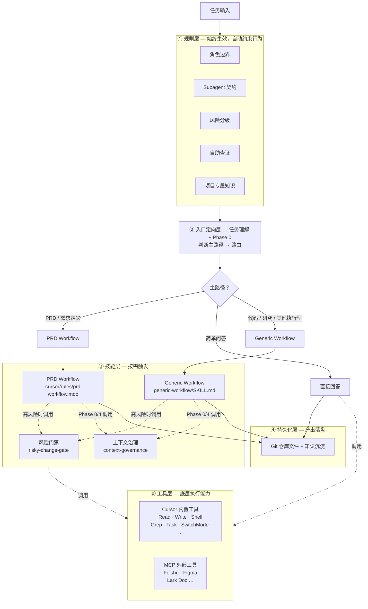

# Cursor 原生任务编排架构 v1

> 创建日期：2026-04-11
> 状态：v1 已进入稳定运行基线 — 规则层(5) + 技能层 + **本仓库 PRD Runtime**（`.cursor/rules/prd-workflow.mdc`）+ Generic Workflow + Context Governance v1.1 + Workflow Evolution Policy v1.0 + Routing QA 通过
> 作者：Kelvin + Cursor Agent
> 审核：**已审核** — Kelvin 2026-04-11

## 1. 设计原则

- **用户级** (`~/.cursor/`) = 跨项目通用，所有工作区自动继承
- **项目级** (`<repo>/.cursor/`) = 项目专属，按需补充
- **规则** (rules) = 始终生效的行为约束，每次会话自动加载
- **技能** (skills) = 按需触发的可执行工作流剧本
- 各 Workflow 独立模块、独立迭代，不耦合在一份文档里
- 所有配置均为 Markdown，易读、易改、可 Git 版本控制

## 2. 架构总图



**五层总览**

| 层 | 加载方式 | 说明 | 需要配置？ |
|----|---------|------|-----------|
| ① 规则层 | 始终生效 | 5 个本地 `.mdc` 规则：角色边界、subagent 契约、风险分级、自助查证、项目专属知识 | 需要 — `~/.cursor/rules/*.mdc` |
| ② 入口定向层 | 会话开始时 | 用户诉求 + 规则层 + Workflow Phase 0；工作区可选用 `task-dispatcher.mdc` 作为 **PRD 主路径的强制首跳**（见 §3.1） | 可选：`~/.cursor/rules/task-dispatcher.mdc` |
| ③ 技能层 | 按需触发 | Workflow（PRD / Generic）和共享能力（风险门禁 + 上下文治理）；workflow gate 直接写入各自正文 | 需要 — `~/.cursor/skills/*/SKILL.md` |
| ④ 持久化层 | 自动 | 产出写入 Git 仓库文件，天然版本控制 | 无需配置 |
| ⑤ 工具层 | 始终可用 | Cursor 内置工具（Read/Write/Shell/Task 等）+ MCP 外部工具（Feishu/Figma 等） | 内置无需配置；MCP 维护 `~/.cursor/mcp.json` |

## 3. 核心决策记录

### 3.1 入口定向与 `task-dispatcher.mdc` 的关系

- **无单独「路由服务」**：派发仍由模型在会话内完成；不存在独立配置文件即等于自动路由。
- **规则层可执行子集**：若工作区启用 `~/.cursor/rules/task-dispatcher.mdc`（`alwaysApply`），则对 **PRD 类关键词命中** 强制执行：读取 **本仓库** `.cursor/rules/prd-workflow.mdc`（若不存在则回退 `~/.cursor/skills/prd-workflow/SKILL.md`）→ Step 1 澄清 → 等待用户回答；对 **纯代码 / 单轮事实问答 / 明确口头讨论** 等排除条件与本文一致。
- **Workflow Phase 0**：在已进入某条 flow 之后，负责主导类型（含 Generic 内的 `hybrid`）、复杂度、是否转交专 flow、是否接入 `risky-change-gate`；**不重复定义** PRD 的门禁正文（门禁以 **`.cursor/rules/prd-workflow.mdc`** 为准）。
- **路径口径**：`PRD` / `Generic（含 code、research、hybrid、other）` / `quick answer`；风险分级、模式切换、subagent 阈值仍以规则层 + 各 workflow 为准。

**结论**：② 层 = **`task-dispatcher.mdc`（若部署）** + **各 SKILL 的 Phase 0**；架构图不绑定单一文件名，但验收与回归仍以「当前工作区实际加载的规则 + SKILL」为真源。

### 3.2 五层各司其职

| 层 | 本质 | 关键区分 |
|----|------|---------|
| **规则层** | 行为约束 | 始终生效，无需 flow 主动调用 |
| **入口定向层** | 主路径判定 | 由用户诉求 + 规则层 + Workflow Phase 0 共同完成 |
| **技能层** | 工作流剧本 + 共享能力 | 按需触发，gate 直接写入 workflow 正文；共享能力单独成 skill |
| **持久化层** | 产出落盘 | Git 文件，无额外配置 |
| **工具层** | 底层执行能力 | Cursor 内置工具无需配置；MCP 工具维护 `mcp.json` |

### 3.3 各 Workflow 独立模块

- 当前仅落地 **PRD** 与 **Generic** 两条专 flow（各一个 SKILL.md）；其余类型（如代码实现、研究分析）暂由 **Generic** 承接，有精力再拆专 flow
- 每个 Workflow 内部自己决定何时做风险评估、何时切模式、何时调 Subagent
- 可以独立迭代，不影响其他 flow

### 3.4 角色与 Subagent 执行纪律

- 长期角色固定为 5 类：`Architecture Owner`、`Governance Owner`、`PRD Owner`、`Delivery Executor`、`Reviewer`
- 每轮 workstream 必须同时明确：`artifact owner` 与 `governance writer`
- 主代理负责最终收敛；subagent 默认只读，只允许写自己的报告/notes 输出文件
- workflow gate：PRD 归位到 **`.cursor/rules/prd-workflow.mdc`**；通用流仍见 `generic-workflow.md`

## 4. 文件结构

```
~/.cursor/
  ┌─ ① 规则层 ────────────────────────────────────
  rules/
  │ agent-roles.mdc                   长期角色边界与默认流转
  │ subagent-contracts.mdc            派生 subagent 契约与派发阈值
  │ risk-triage.mdc                   风险分级与高风险接门禁
  │ self-serve-lookups.mdc            能查到的就不要问
  │ （项目仓库 `.cursor/rules/`，如 bridge-architecture.mdc）
  │
  ┌─ ③ 技能层 ────────────────────────────────────
  skills/
  │ risky-change-gate/SKILL.md        共享能力：高风险门禁
  │ risky-change-gate/reference.md    命令模板与场景检查表
  │ context-governance/SKILL.md       共享能力：跨会话上下文治理（Git 原生）
  │ prd-workflow/SKILL.md             PRD 工作流（跨项目可选副本）
  │ generic-workflow/SKILL.md         通用兜底工作流（后续交付）
  │ （后续可补充 code-workflow、research-workflow 等）
  │
  ┌─ ⑤ 工具层 ────────────────────────────────────
  mcp.json                            MCP 外部工具配置
  （Cursor 内置工具无需配置文件）
  │
  ┌─ 其他 ────────────────────────────────────────
  cli-config.json                     CLI 行为配置

<repo>/
  .cursor/rules/
  │ prd-workflow.mdc                  PRD Runtime（本项目真源）
  docs/cursor-architecture/
  ┌─ 上下文治理（Context Governance）─────────────
  context-governance.md               上下文治理规范（权威）
  context/context-schema.md        上下文索引字段级 schema
  context/
  │ active-workstreams.md             活跃任务状态
  │ decision-log.md                   决策日志
  │ artifact-index.md                 关键产物索引
```

> ④ 持久化层无独立服务——产出与上下文都直接写入项目 Git 仓库。

## 5. 规则层详细设计（当前运行时）

### 5.1 agent-roles.mdc

- 固定长期角色为 5 类：`Architecture Owner`、`Governance Owner`、`PRD Owner`、`Delivery Executor`、`Reviewer`
- 每轮 workstream 必须明确 `artifact owner` 与 `governance writer`
- 角色边界落到文件/目录级，避免 PRD 与 Delivery 越界

### 5.2 subagent-contracts.mdc

- subagent 默认只读，不升级为主代理
- 只允许写自己的报告、notes、findings 输出文件
- 满足并行调查、正交评审、高风险独立验证等阈值时才派发
- 主代理必须二次核验关键结论，不能把 subagent 输出直接当最终事实

### 5.3 risk-triage.mdc

- 实施前先做 `low / medium / high` 风险分级
- 命中高风险时必须接入 `risky-change-gate`
- 对配置、权限、部署、桥接脚本、环境变量组合等场景上调风险等级

### 5.4 self-serve-lookups.mdc

- 能通过仓库、本机、工具查到的信息，不向用户反问
- 默认少打断、多执行
- 只有账号密码、未提交决策或必须用户权衡的问题才提问

### 5.5 项目仓库规则（`.cursor/rules/`）

- 承载项目专属知识、链路说明与排障规则（例如 `bridge-architecture.mdc`）
- **PRD Runtime**：`prd-workflow.mdc` 为可执行门禁与评审闭环（与 `docs/cursor-architecture/prd-workflow.md` 衔接说明配合使用）
- 属于项目知识规则，不承担通用角色/流程约束（角色边界仍以用户级 `agent-roles.mdc` 等为准，若已部署）

## 6. 技能层详细设计

### 6.1 risky-change-gate（按需触发）

由任意 flow 在内部识别到高风险变更时调用。

| 阶段 | 职责 |
|------|------|
| Phase A | 变更计划：目标、影响、步骤、回滚、风险假设 |
| Phase B | 自审检查表：幂等、备份、最小权限、停血方案 |
| Phase C | 实施追踪：每步记录命令+结果 |
| Phase D | 可执行验证：冒烟 + 深度 + 反向用例 + 完成矩阵 |

附带 `reference.md` 放常用命令模板（系统、网络、配置、数据等场景）。

### 6.2 context-governance（按需触发，Phase 0/4）

用于跨会话上下文管理，替代不可用的外部记忆 CLI；统一采用 Git 原生方案。流程级说明见 **`docs/cursor-architecture/context-governance.md`**（权威）；本节为摘要。

| 环节 | 职责 |
|------|------|
| Load（Phase 0 前） | 读取 `context/context-schema.md` + 三份索引文件，恢复上下文与字段约束 |
| Write-back（Phase 4 后） | 按 schema 更新活跃任务状态、决策日志与产物索引 |
| 冲突处理 | 上下文与用户新指令冲突时，用户指令优先，并记录覆盖原因与替代关系 |

## 7. 后续模块规划

各 Workflow 作为独立文档，在本目录下分别设计：

| 模块 | 文件 | 版本 | 状态 |
|------|------|------|------|
| 架构总览 | `README.md` | v1 | ✅ 已完成，已审核 |
| 规则层 × 5（本地运行时） | `~/.cursor/rules/*.mdc` | v1 | ✅ 已部署，已审核 |
| 角色规则 | `agent-roles.mdc` | v1 | ✅ 已新增并启用 |
| Subagent 契约 | `subagent-contracts.mdc` | v1 | ✅ 已新增并启用 |
| 旧 memctl 规则退役 | `session-memory/context-assembly/artifact-management` | retired | ✅ 已删除，口径统一到 Git-native Context Governance |
| PRD 工作流衔接说明 | `prd-workflow.md` | v2 | ✅ 指向 `.cursor/rules/prd-workflow.mdc`，不重复门禁正文 |
| PRD Runtime Skill（真源） | `.cursor/rules/prd-workflow.mdc` | v2 | ✅ Brief + 骨架 + 正文 + 自动评审闭环 |
| PRD 工作流技能（可选） | `~/.cursor/skills/prd-workflow/SKILL.md` | — | 跨项目副本；与 `.mdc` 冲突时以 `.mdc` 为准 |
| 通用兜底工作流设计文档 | `generic-workflow.md` | v1.2（轻量执行版） | ✅ 已完成，已审核 |
| 通用兜底工作流技能 | `~/.cursor/skills/generic-workflow/SKILL.md` | 同步 v1.2 | ✅ 已落地 |
| Generic v1.2 评审清单 | `generic-workflow-v1.2-review-checklist.md` | v1 | ✅ 已新增，可直接评审 |
| 上下文治理设计文档 | `context-governance.md` | v1.1 | ✅ 已补强（Schema + 状态机） |
| 上下文 Schema 文档 | `context/context-schema.md` | v1.1 | ✅ `active-workstreams` 双 Owner 列与 agent-roles 对齐 |
| 上下文治理技能 | `~/.cursor/skills/context-governance/SKILL.md` | v1 | ✅ 已落地 |
| Workflow 演进策略 | `workflow-evolution-policy.md` | v1.0 | ✅ 已完成，已纳入治理台账 |
| 上下文索引文件 | `docs/cursor-architecture/context/*.md` | v1 | ✅ 已初始化 |
| 入口定向机制 | `task-dispatcher.mdc`（可选）+ 用户诉求 + 规则层 + Workflow Phase 0 | v1.1 | ✅ 已与 README §3.1 对齐 |
| 端到端一致性验证 | `routing-fixtures.md` + `routing-conversation-fixtures.md` + `e2e-test-matrix.md` + `architecture-validation-report.md` | R1/R2 | ✅ 已完成（单轮 30 条 + 多轮 12 条均通过） |
| 实战 dry run | `dry-run-plan.md` + `dry-run-checklist.md` + `dry-run-rerun-report.md` | v1.0 | ✅ 已执行并通过（5/5 场景通过；DR-04 恢复成功；DR-05 0 漏拦截） |
| Context Governance Skill 修复 | `context-governance-skill-fix-report.md` | v1 | ✅ 已完成（DF-01 / DF-02 已关闭） |
| 项目专属规则 | 各项目 `.cursor/rules/` | — | ⏳ 待设计 |

有精力再补充（本目录 + `~/.cursor/skills/`）：例如代码实现工作流、研究分析工作流等专 flow，并从 Generic 中逐步迁出对应触发条件。

## 8. 与原母架构的关系

本方案不是母架构的"降级映射"，而是利用 Cursor 原生能力的重新设计：

| 维度 | 母架构 | Cursor 原生版 |
|------|--------|---------------|
| 入口 | 外部 Task Intake + Router 引擎 | 规则层 + Workflow Phase 0 共同完成主路径定向 |
| Workflow | 状态机 + Worker 池 | SKILL.md 剧本，主线程按阶段推进 |
| 多 Worker | 持久化 worker 进程并行 | Subagent 会话内临时派生，只读探索 |
| 共享能力 | 常驻服务 | 规则（始终加载）+ 技能（按需触发）+ 平台能力（Cursor 内置） |
| 持久化 | 外部数据库 / state store | Git 仓库文件，天然版本控制 |
| 审批 | 企业级签核链 | 对话内确认点 + PR 审查 |
| 知识沉淀 | 知识库引擎 | 写入仓库 docs/rules/模板 |
