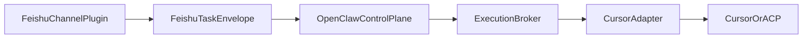

# Feishu Channel Plugin 边界说明

本文件定义方案 B 下的职责重划分：

- 什么保留在 Feishu plugin
- 什么迁入 OpenClaw control plane
- 什么属于 Cursor / 执行器层

---

## 目标边界

---

## 一、保留在 Feishu Channel Plugin 的能力

### 1. 飞书连接与事件接收

- WebSocket / webhook 接入
- `im.message.receive_v1`
- Bot 自身身份查询

对应当前文件：

- `feishu-ws-cursor.js`
- `lib/feishu-channel/bridge-host.js`
- `lib/feishu-tenant.js`

### 2. 飞书消息解析

- 文本 / post / interactive 解析
- merge-forward 结构处理
- message type 兼容

对应当前文件：

- `lib/feishu-im-parse.js`
- `lib/feishu-cursor/ingestion/in-memory-state.js`

### 3. 飞书特有上下文

- 群聊 `@bot` 规则
- 引用父消息
- `@成员` 注入
- Feishu replyTarget 构建

对应当前文件：

- `lib/feishu-group-at-bot.js`
- `lib/feishu-quoted-parent-context.js`
- `lib/feishu-at-context.js`

### 4. 飞书媒体下载

- 图片/文件/音频资源下载
- `fetchMessage`
- 清理临时文件

对应当前文件：

- `lib/feishu-media.js`

### 5. 飞书输出层

- 发 text / post / card
- reaction ACK
- timing footer
- docx API 能力本身

对应当前文件：

- `lib/feishu-tenant.js`
- `lib/run-reply-format.js`
- `lib/feishu-reply-timing.js`
- `lib/feishu-docx-export.js`
- `lib/feishu-docx-markdown.js`

---

## 二、迁入 OpenClaw Control Plane 的能力

### 1. 意图分类

不应继续停留在渠道层：

- report / research / relay / sheet 分类
- 是否需要 clarification
- 是否需要 tool / full runner

当前实现位置：

- `lib/feishu-cursor/policies/task-classifier.js`
- `lib/feishu-cursor-route.js`

### 2. 策略与安全

- safety policy
- relay policy
- prompt 归一化
- profile / permission / cleanCwd 语义

当前实现位置：

- `lib/feishu-cursor/policies/`
- `lib/feishu-cursor/runner/runner-selector.js`

### 3. 记忆与会话策略

- 何时注入 memory
- 如何 persist turn
- session 级策略

当前实现位置：

- `lib/feishu-session-memory.js`
- `lib/feishu-cursor/memory/`

### 4. 结果策略

- 何时导出 docx
- 聊天中发摘要还是全文
- relay/sanitize 的最终结果策略

当前实现位置：

- `lib/feishu-docx-export.js` 的部分触发逻辑
- `lib/feishu-cursor-route.js`
- `lib/feishu-cursor/pipeline-v2.js`

---

## 三、保留在 Cursor / 执行器层的能力

这些不应感知飞书：

- 代码执行
- ACP / Cursor 调度
- 文件改写
- MCP
- 工作区工具调用

OpenClaw 只负责选择执行器，不让 Cursor 关心飞书通道细节。

---

## 四、当前代码中的中间态实现

为落地方案 B，当前仓库已新增两层中间边界：

### `lib/feishu-channel/`

用于承接未来插件层：

- `plugin-runtime.js`
- `models/feishu-task-envelope.js`

### `lib/openclaw-control-plane/`

用于承接未来控制平面逻辑：

- `intent-router.js`
- `policy-engine.js`
- `execution-broker.js`
- `request-planner.js`
- `session-dispatch.js`
- `result-policy.js`
- `structured-result.js`

这不是最终 OpenClaw 内部实现，而是把现有 bridge 内逻辑先分层、先变薄。当前已要求新策略优先写入这里，而不是继续长在 `pipeline-v2.js` 或入口脚本。

---

## 五、禁止继续做的事情

为避免 bridge 继续膨胀，新增逻辑禁止再放到下面位置：

- `lib/feishu-cursor-route.js`
- `lib/feishu-cursor/pipeline-v2.js`

如果新增内容属于：

- 意图分类
- 执行器选择
- prompt / safety / relay 策略
- docx 导出判定
- memory 策略

则应优先进入：

- `lib/openclaw-control-plane/`

---

## 六、验收标准

当以下条件成立时，说明边界划分成功：

1. Feishu plugin 可以独立解释“如何收消息、如何发消息”
2. OpenClaw control plane 可以独立解释“如何理解任务、如何选执行器”
3. Cursor adapter 可以独立解释“如何执行代码任务”
4. `feishu-ws-cursor.js` 仅作为兼容入口，宿主装配已迁入 `bridge-host.js`
5. 任一层替换时，不需要跨层理解全部细节
