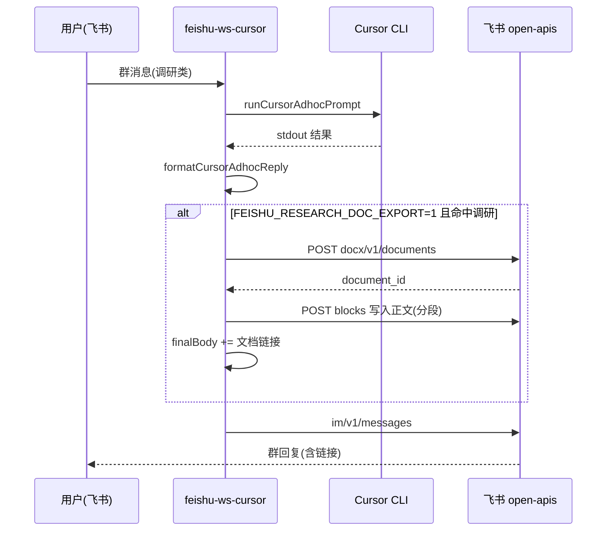

# 飞书调研结果落云文档：技术论证与实施方案

> 角色：技术实施视角  
> 日期：2026-04-14  
> 前置阅读：[可行性调研](./feishu-cursor-research-output-doc-feasibility.md)  
> 关联代码：`lib/feishu-tenant.js`、`lib/feishu-cursor-route.js`（`isResearchLikeTask`）、`lib/feishu-cursor/pipeline-v2.js`、`lib/feishu-online-doc.js`

---

## 第一部分：技术论证

### 1.1 问题形式化

- **输入**：群聊中一条触发 Cursor 的用户文本，且语义为「调研 / 研究 / 竞品 / deep dive」等（与现有 `isResearchLikeTask` 对齐）。  
- **输出**：除现有「会话内回复」外，增加一个 **飞书新版文档（docx）** 的稳定 URL，使成员可 **从飞书客户端直接打开** 阅读、转发、评论。  
- **约束**：尽量复用现有 **租户凭证** 与 **单条回复出口**；不引入第二套 OAuth，除非产品明确要求「落到指定用户云空间目录」。

### 1.2 为何采用「开放平台服务端 API」而非 Agent 本地建文件

| 维度 | 服务端创建 docx | Agent 写仓库 md 再人工上传 |
|------|------------------|---------------------------|
| 用户体验 | 链路透传，**一条消息含链接** | 依赖人工或另一套同步 |
| 凭证 | 已有 `tenant_access_token`（`lib/feishu-tenant.js`） | 与飞书无关，无法直接得飞书 URL |
| 与 `normalizeCursorTask` 关系 | **不冲突**：`isReportLikeTask` 禁止的是「Agent 创建真实文档文件 / 调外部文档编辑工具」；**本方案由桥接进程调飞书 API**，不经过 Agent 文件系统写 docx | 一致 |

论证结论：**用 Node 侧在 Cursor 子进程结束后调用 `docx/v1` 写接口**，与当前「读 docx」栈同源，工程边界清晰。

### 1.3 挂载点：为何选在 `pipeline-v2` 发回复之前

当前飞书 WS 主链路在 `createFeishuCursorPipelineV2` 内已完成：

1. `runCursorAdhocPrompt` → `formatCursorAdhocReply` 得到 `body`  
2. `appendFeishuTimingToReplyBody` → `sanitizeRelayReplyBody` 得 `finalBody`  
3. `sendFeishuChatReply(chatId, finalBody)` 发出  

**论证**：在步骤 2 与 3 之间插入「可选：创建 docx → 将 URL 追加/前置到 `finalBody`」：

- **单一出口**：所有 WS 触发的助手回复都经 pipeline 此处收口。  
- **天然具备 `chatId`、原始任务文本、classification`**，可与 `isResearchLikeTask(userTask)` 及环境开关做与门。  
- **失败降级**：写飞书失败时仍发送原 `finalBody`，仅打日志 + 可选一句「云文档创建失败」。

### 1.4 与 `isResearchLikeTask` / `isReportLikeTask` 的分工

| 函数 | 现状 | 与本方案关系 |
|------|------|----------------|
| `isResearchLikeTask` | 关键词识别调研向任务 | **建议作为开启云文档导出的主条件之一**（与 env 开关与门） |
| `isReportLikeTask` | 注入「飞书可读 Markdown、不要创建真实文档文件」 | **不阻碍**：导出由桥接创建飞书 doc，不要求 Agent 写本地 Office 文件；若未来希望「数据报告」也落 doc，可共用同一导出模块，仅需产品确认是否覆盖 report 类 |

### 1.5 与「仅发 IM 长文」的关系

- 现有 `sendFeishuChatReply` 已支持较长 `post` 正文，适合 **摘要 + 链接**。  
- 云文档解决的是：**归档、版式、协作、权限与搜索** 不在 IM 内的问题。二者 **互补**，不是二选一硬替换。

### 1.6 技术风险与接受前提（实施前需书面确认）

1. **租户 token + `folder_token`**：官方约束为应用身份下文件夹须为 **应用自建**；若必须落在「某部门知识库」，可能要 **user_access_token** 或企业开通应用目录权限——成本上调，应列为 **Phase 2 可选**。  
2. **正文写入**：创建接口仅标题；正文需 **blocks 批量创建** 或 **Drive 复制模板**；MVP 建议 **纯文本分段** 降低 block schema 风险。  
3. **可见性**：文档 ACL 依赖企业云空间策略；**Go/No-Go 以手工调 API 创建 + 群内非管理员账号打开为准**。

---

## 第二部分：实施方案

### 2.1 范围

**本期（MVP）做：**

- 开关开启且任务命中「调研类」规则时：创建 docx → 写入 **纯文本正文**（由 Cursor 回复全文或截断策略决定）→ 在飞书回复中附带 **可点击 URL**。  

**本期明确不做：**

- 复杂 Markdown 全量映射（表格/代码高亮/内嵌画板）。  
- 自动把文档挂到任意 Wiki 节点（需 wiki v2 与额外权限设计）。  
- 依赖用户 OAuth 的个人空间写入（可作为后续 Phase）。

### 2.2 总体数据流

### 2.3 阶段划分

| 阶段 | 交付物 | 说明 |
|------|--------|------|
| **P0 预验证**（运维 + 开发 0.5～1d） | curl/脚本用现网 `tenant_access_token` 调通 `POST /docx/v1/documents`，非研发群成员能打开链接 | 失败则先改 scope/文件夹，不写业务代码 |
| **MVP**（约 3～5d） | `lib/feishu-docx-export.js`：`createDocument` + `appendPlainTextAsBlocks`（或单 block 大文本若官方允许）；`pipeline-v2` 插入调用；环境变量开关；失败降级与日志 | 正文 MVP：单段落或多段落纯文本 |

**MVP 代码落地（2026-04-14）**：已实现 `lib/feishu-docx-export.js`（`POST /docx/v1/documents` + `.../blocks/:parent/descendant` 分批写入）及 `pipeline-v2.js` 在发群前的 `maybeAppendFeishuResearchDocUrl` 挂钩；可选依赖 `exportResearchDocHook` 便于单测注入。环境变量说明见 `deploy/feishu-ws-cursor-bot.env.example`。

**增强（同日）**：`lib/feishu-docx-markdown.js` 将 Markdown 子集映射为飞书块（标题 1–9、正文、无序/有序列表、代码块、引用、分割线、表格→代码块展示）；`FEISHU_CLOUD_DOC_EXPORT` 与 `FEISHU_RESEARCH_DOC_EXPORT` 任一为 `1` 即开启；`FEISHU_DOC_EXPORT_MODES` 控制 `research` / `report`；`task-classifier` 修复 `isReportLikeTask` 未接线导致的报告类漏判；报告类 `normalizeCursorTask` 文案与云文档导出一致。
| **M1**（约 3～7d） | 分片写入、标题取自首行/环境变量模板、频控退避、`document_id` 拼 URL 与 `FEISHU_LARK_DOMAIN` 一致 | 可上小流量群 |
| **M2**（按需） | 模板复制、Markdown 子集（标题/列表）、指标与告警 | 产品驱动 |

### 2.4 环境变量（建议命名）

| 变量 | 必填 | 说明 |
|------|------|------|
| `FEISHU_RESEARCH_DOC_EXPORT` | 否 | `1` 开启；默认 `0` |
| `FEISHU_DOCS_EXPORT_FOLDER_TOKEN` | 否 | 应用自建文件夹 token；空则走官方「根目录」行为（以飞书返回为准） |
| `FEISHU_DOCS_EXPORT_MAX_CHARS` | 否 | 写入 doc 的正文最大字符，防止超大回复打爆 API；超出截断并 IM 注明 |
| `FEISHU_DOCS_EXPORT_TITLE_PREFIX` | 否 | 标题前缀，如 `[调研]` |
| 既有 `FEISHU_APP_ID`、`FEISHU_APP_SECRET*`、`FEISHU_LARK_DOMAIN` | 是 | 与读 doc、发 IM 共用 |

权限：在开发者后台为应用开通 **`docx:document` 或 `docx:document:create`**，以及写入 block 所需 **编辑类** scope（以控制台实际列表为准，与只读读 doc 区分）。

### 2.5 代码改动清单（文件级）

| 文件 | 动作 |
|------|------|
| `lib/feishu-docx-export.js` | **新建**：封装 `createDocxDocument({ title, folderToken })`、`appendBodyFromPlainText(documentId, text, options)`；统一错误结构与日志前缀 `[feishu-docx-export]` |
| `lib/feishu-tenant.js` | 可选：仅复用 `getTenantAccessToken` / `getFeishuApiBase`；或把 axios 封装放在 docx-export 内引用 tenant，避免 tenant 文件过大 |
| `lib/feishu-cursor/pipeline-v2.js` | 在 `sendFeishuChatReply` 之前调用导出；仅当 `process.env.FEISHU_RESEARCH_DOC_EXPORT === "1"` 且 `isResearchLikeTask(userTaskForChain)`（或统一从 `classification` 取原文） |
| `lib/feishu-cursor-route.js` | 可选：`isResearchLikeTask` 在开关开启时追加一句系统提示：「回复将同步到云文档，请使用清晰标题层级」——**非必须**，避免 prompt 膨胀可后置 |
| `deploy/feishu-ws-cursor-bot.env.example` | 补充上述变量说明 |
| `test/feishu-docx-export.test.js` | **新建**：mock axios，测标题截断、频控错误降级、URL 拼接 |
| `test/feishu-cursor-pipeline-v2.test.js` | 增加用例：export 开启 + research 任务 → `sendFeishuChatReply` 收到含 `https://` `docx/` 的 body |

**说明**：其它入口要导出时复用同一 `lib` 或抽 CLI `scripts/feishu-docx-create-from-stdin.js`。

### 2.6 飞书开放平台与企业侧操作清单

1. 自建应用（与现机器人一致）勾选 **创建/编辑新版文档** 相关权限。  
2. 在云空间创建 **应用专用文件夹**，取 `folder_token` 写入 env（推荐，减少 `1770040`）。  
3. 用测试账号验证：**非应用管理员**能否打开链接（ACL）。  
4. 记录频控与「同文件夹串行创建」约束，上线文档中写明「并发调研高峰可能排队」。

### 2.7 测试与验收标准

| 编号 | 场景 | 期望 |
|------|------|------|
| T1 | 开关关 | 行为与线上一致，无额外 API |
| T2 | 开关开 + 非调研任务 | 不调 docx 创建 |
| T3 | 开关开 + 调研任务 + API 成功 | 群内消息含 `docx/` 链接，浏览器打开有正文 |
| T4 | 开关开 + API 失败 | 仍收到原 Cursor 回复；日志含错误码；可选一行中文说明 |
| T5 | 超长正文 | 截断至 `FEISHU_DOCS_EXPORT_MAX_CHARS`，IM 中说明 |

### 2.8 上线与回滚

- **上线**：先灰度 `FEISHU_RESEARCH_DOC_EXPORT=1` 仅在测试群 `FEISHU_CURSOR_ALLOWED_CHAT_IDS` 内验证（若已用 enforce）。  
- **回滚**：置 `0` 并重启 `feishu-ws-cursor-bot`；无需数据迁移。

### 2.9 工时与依赖（粗估）

| 依赖方 | 内容 |
|--------|------|
| 研发 | P0 + MVP + 单测，约 **4～8 人日**（视 block API 熟练度） |
| 运维/飞书管理员 | scope、文件夹、测试账号 ACL，约 **0.5～1 人日** |
| 产品 | 是否覆盖 `isReportLikeTask`、标题命名规则、截断策略文案 |

---

## 第三部分：执行顺序建议（Checklist）

1. [ ] 评审本文 **§1.6** 与 **§2.1** 范围，签字/留言确认。  
2. [ ] 执行 **P0** 手工 API 验证。  
3. [ ] 合并 **MVP** 代码 + 单测 + env 示例。  
4. [ ] 测试群 **T1～T5**。  
5. [ ] 生产灰度 → 全量开关文档化。

---

## 文档关系

- **可行性调研**：回答「能不能做、缺什么权限」。  
- **本文**：回答「为何这样做、改哪些文件、怎么验收与上线」。
