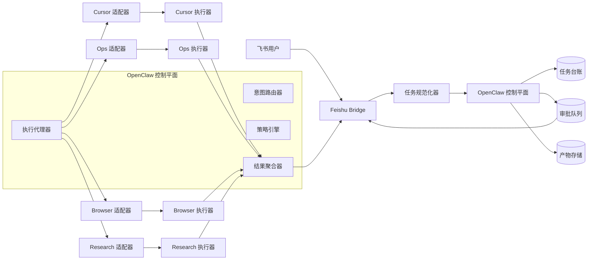
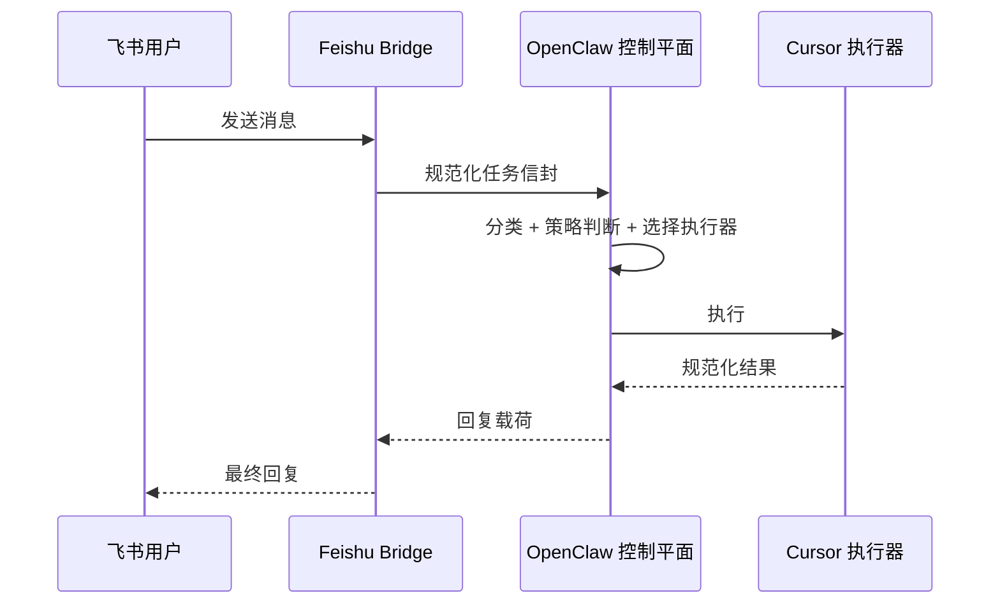
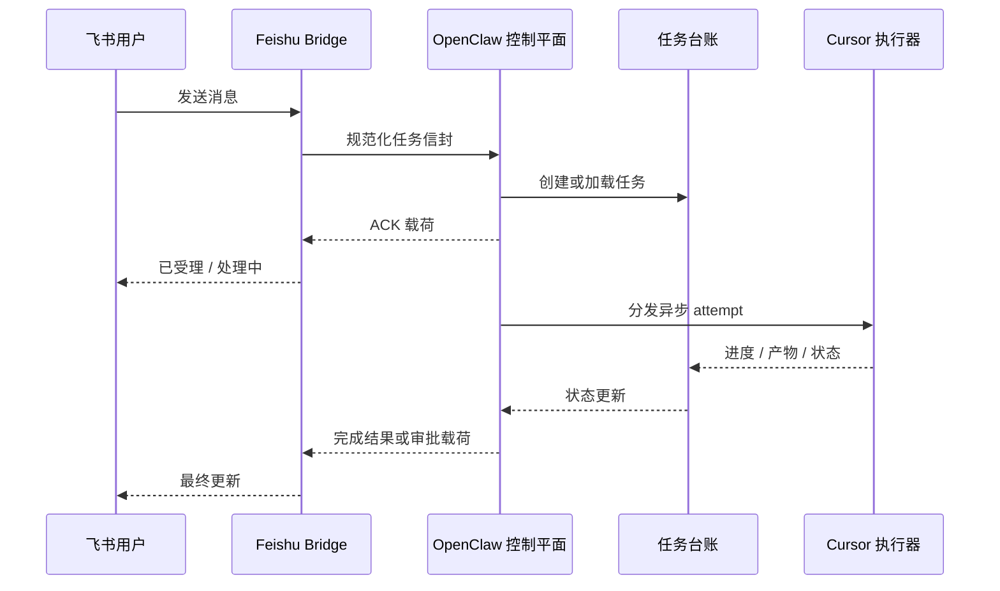

# 飞书 - OpenClaw - Cursor 架构 v2

## 定位

这个版本保留了原始战略方向：

- `Feishu` 是交互入口
- `OpenClaw` 是控制平面
- `Cursor` 是代码类重任务的默认优先执行器

但它修正了上一版中的三个架构弱点：

1. 避免把 `OpenClaw` 做成一个以 Cursor 为形状的前置处理器
2. 让异步执行具备状态性和幂等性
3. 将编排权限与执行权限彻底分离

目标不只是“纸面上解耦”，而是“运行时稳定”。

## 修正后的架构

### 第 1 层：通道网关

`Feishu Bridge`

职责：

- 接收飞书消息与事件
- 解析文本、文件、语音、图片、@提及和引用父消息上下文
- 生成初始规范化请求
- 向飞书回传 ACK / 进度 / 最终回复

非职责：

- 不负责选择执行器
- 不直接持有 shell 或部署权限
- 不负责审批决策

### 第 2 层：控制平面

`OpenClaw Control Plane`

它仍然是系统大脑，但现在被拆成四个内部模块：

1. `Intent Router`
   - 分类请求类型
   - 估算任务成本
   - 决定走同步还是异步
   - 提取所需能力集

2. `Policy Engine`
   - 计算风险等级
   - 执行环境限制
   - 判断是否需要审批
   - 应用租户 / 团队策略

3. `Execution Broker`
   - 根据任务需求匹配执行器能力
   - 按策略权重选择首选执行器
   - 将任务提交给执行器适配器
   - 处理重试与故障切换规则

4. `Result Aggregator`
   - 规范化执行器输出
   - 决定回复形态
   - 持久化产物与完成状态

关键修正：
`Cursor-first` 现在是一种策略偏好，而不是结构依赖。
这意味着 OpenClaw 在代码任务上可以优先选择 Cursor，但控制平面本身不再以 Cursor 为中心塑形。

### 第 3 层：任务骨干层

这一层在上一版中表达得不够清晰。

现在需要显式存在：

- `Task Ledger`
- `Approval Queue`
- `Artifact Store`

`Task Ledger` 是必需的，因为异步行为在以下情况下也必须保持正确：

- 飞书回复发送失败
- 执行器崩溃
- OpenClaw 重启
- 同一条消息被重复投递
- 审批打断一条正在运行的执行链

### 第 4 层：执行器适配器

适配器负责把中立任务协议翻译成执行器原生调用。

示例：

- `Cursor Adapter`
- `Ops Adapter`
- `Research Adapter`
- `Browser Adapter`

适配器可以理解执行器细节。
但 OpenClaw 核心层不可以。

### 第 5 层：执行器

执行器负责真正完成工作。

示例：

- `Cursor Executor`
- `Shell/Ops Executor`
- `Browser Executor`
- `Research Executor`

关键修正：
权限属于执行器运行时，而不是属于 OpenClaw 本体。

## 修正后的拓扑



## 中立协议 v2

上一版协议过于单薄。
这个版本补充的是运行时语义，而不只是业务字段。

### 任务信封

必填字段：

- `taskId`
- `source`
- `sourceMessageId`
- `sourceThreadKey`
- `dedupeKey`
- `taskType`
- `mode`
- `intent`
- `requiredCapabilities`
- `riskLevel`
- `workspace`
- `inputs`
- `constraints`
- `replyTarget`
- `timestamps`

关键修正：

- `dedupeKey` 是实现幂等性的必填字段
- `replyTarget` 必须显式存在，避免任务完成依赖桥接层的瞬时内存
- `requiredCapabilities` 用于驱动执行器匹配，而不是把 Cursor 路由硬编码进系统

### 结果协议

必填字段：

- `taskId`
- `attempt`
- `executorId`
- `status`
- `summary`
- `progressEvents`
- `actionsTaken`
- `verification`
- `artifacts`
- `needsApproval`
- `resumeToken`
- `errorClass`

关键修正：

- `needsApproval` 是一等字段，不是异常路径
- `resumeToken` 允许审批后的暂停任务继续运行
- `executorId` 必须持久化，便于观测和审计

## 状态模型

上一版描述了异步，但没有定义完整生命周期。
这个版本把任务状态显式化。

### 标准状态

```text
RECEIVED
-> NORMALIZED
-> CLASSIFIED
-> ACCEPTED
-> DISPATCHED
-> RUNNING
-> WAITING_APPROVAL
-> RESUMED
-> SUCCEEDED | FAILED | CANCELLED | ORPHANED
```

### 状态规则

- 只允许一个终态
- 重试会生成新的 `attempt`，而不是新的 `taskId`
- 重复来源消息必须归并到同一个 `taskId`
- 回帖到飞书成功不等于任务成功
- 如果执行器已完成但回调失败，任务在恢复前内部应进入 `SUCCEEDED_UNREPORTED`

## 同步与异步语义

### 同步路径

仅在以下条件全部满足时使用：

- 低风险
- 不需要审批
- 运行时长有明确上界
- 输出体积有明确上界
- 执行器可立即获取



### 异步路径

在以下任一情况出现时使用：

- 改代码
- 跑测试
- 浏览器自动化
- 大附件处理
- 受审批约束的动作
- 预期运行时间较长



## 审批边界

这是一个重要修正点。

审批不再被视为一个松散的 UI 行为。
它现在是控制平面中的正式状态迁移。

规则：

- 由 `OpenClaw` 决定是否需要审批
- 由 `Approval Queue` 持久化待审批状态
- 执行器不得自行批准高权限动作
- 审批通过后，以同一个 `taskId` 恢复暂停任务

这样可以防止一种常见故障：执行器在审批通过之前，已经先拿到了足够的权限去执行高风险动作。

## 权限分离

这是第二个重要修正点。

### Feishu Bridge

- 只持有飞书应用凭据
- 不持有 shell 权限
- 不持有部署权限

### OpenClaw Control Plane

- 只持有编排权限
- 可以读取策略与任务状态
- 默认不得持有生产 shell 权限

### Cursor Executor

默认能力画像：

- 仓库读权限
- 仓库写权限
- 测试执行权限
- 受边界约束的终端执行权限

默认不具备的能力：

- 不允许重启服务
- 不允许修改 secret
- 不允许修改 nginx/systemd

### Ops Executor

单独承载高权限运行时，用于：

- 重启服务
- 收集日志
- 执行部署脚本
- 执行主机级动作

这解决了上一版里“想自动化”和“又要审批”并存，但运行时权限边界没有定义清楚的歧义。

## 执行器选择规则

这是第三个重要修正点。

现在的选择公式是：

`requiredCapabilities + policyWeight + executorHealth + environmentConstraint`

而不是：

`if code task then Cursor`

这样既保留了你的原始诉求，也避免了结构绑定：

- Cursor 仍然是高成本代码任务的优先执行器
- OpenClaw 仍然扮演编排器角色
- 将来即使拆掉 Cursor，也不会让控制平面失效

## 架构不变量

这些规则在实现阶段不应被打破：

1. `OpenClaw core` 不得包含 Cursor 专用 prompt 模板
2. `task success` 必须与 `reply delivered` 明确区分
3. `approval` 必须是持久化状态，而不只是前端交互
4. `executor privilege` 必须由能力策略下界约束，而不是为了方便放大权限
5. `Cursor preference` 必须保持为可配置策略，而不是固化进结构
6. `duplicate Feishu delivery` 必须具备幂等性
7. `artifacts` 必须能够独立于最终回复文本被恢复

## 评审收口

这个 v2 架构对主要评审问题的收口如下：

- **Cursor 依赖张力**：通过把 Cursor 偏好移入 broker 策略，而不是写进控制平面结构，显著降低
- **异步一致性风险**：通过引入 task ledger、attempt、dedupeKey 和显式状态机，显著降低
- **权限边界歧义**：通过拆分 bridge、control plane、Cursor executor 和 Ops executor 的权限范围，显著降低

最终结果是：这个系统在实践上仍然可以保持 `Cursor-first`，但在架构上已经不再被 Cursor 绑定。
